# Spark Exercises
Basado en el pdf EXERCISES SPARK BIT - EN

- [Spark Exercises](#spark-exercises)
  - [Module 1. Exercise: Using the Spark Shell](#module-1-exercise-using-the-spark-shell)
  - [Module 2. Exercise: Starting with RDDs](#module-2-exercise-starting-with-rdds)
    - [A. Exploration of plain file 1](#a-exploration-of-plain-file-1)
    - [B. Exploration of plain file 2](#b-exploration-of-plain-file-2)
    - [C. Exploration of a set of plain files a folder](#c-exploration-of-a-set-of-plain-files-a-folder)
  - [Module 4. Exercise: Working with PairRDDs](#module-4-exercise-working-with-pairrdds)
    - [A- Work with every data of the logs folder: “C:\\Users\\didac.blanco\\Desktop\\BIT\\data\\weblogs”](#a--work-with-every-data-of-the-logs-folder-cusersdidacblancodesktopbitdataweblogs)
    - [B- Work with every data of the “logs” folder: “/home/BIT/data/accounts.cvs”](#b--work-with-every-data-of-the-logs-folder-homebitdataaccountscvs)
    - [C- Work with more methods on pairs RDD](#c--work-with-more-methods-on-pairs-rdd)
  - [Module 5.1. Exercise: SparkSQL (JSON)](#module-51-exercise-sparksql-json)
  - [Module 5.3. Exercise: SparkSQL (DataFrames)](#module-53-exercise-sparksql-dataframes)
  - [Modulo 5.4. Ejercicios opcionales: Trabajando con SparkSQL](#modulo-54-ejercicios-opcionales-trabajando-con-sparksql)
  - [Module 6.1. Exercise: Spark Streaming I](#module-61-exercise-spark-streaming-i)


## Module 1. Exercise: Using the Spark Shell 

The purpose of this exercise is to work with the Spark Shell in Scala to read a file in a RDD.
Tasks to be done:

1. Start the Spark Shell for Scala and get familiar with the information that appears on the 
screen (Infos, warnings, Scala’s version, Spark’s version …). It will take a little while to 
get started. 
    >spark-shell
    
    >pyspark
2. Check if a context “sc” has been successfully created as we can see in the documentation. You should see something like this in your screen:
res0:org.apache.spark.SparkContext= org.apache.spark.SparkContext@”alphanum”
    >Escribir “sc”

    >En python sale: 
    "\<SparkContext master=local[*] appName=PySparkShell>"
1. Using the auto-complete command on SparkContext you can see a list of available 
methods. The Auto-complete function consists of pressing tabulator key after typing the 
SparkContext object followed by a dot. 
    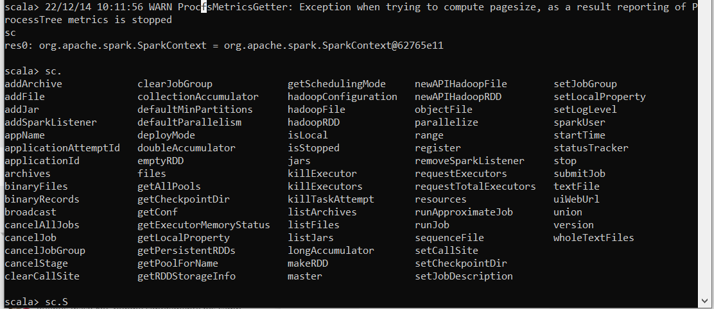
1. To exit the Shell you can type “exit” or you can press CTRL + C.

## Module 2. Exercise: Starting with RDDs

The objective of this exercise is to practice with RDD’s trough Spark Shell, for which we will use 
external files.

A common practice testing phase of data analitics is to analyze small files that are subsets of 
related datasets to be used in production. Sometimes, these files are not physically in any 
node of the cluster, so it will be necessary to import them in some way

A simple way to do these transfers between our Host and the VM/Cluster is through tools like 
Winscp (https://winscp.net/eng/download.php).
Another option to do this is as in the previous exercises, in other words, through a shared folder
with the VM or copying the files directly to the VM.

### A. Exploration of plain file 1

Tasks to be done:

> Al trabajar desde el propio Windows, los primeros 5 pasos no los realizo tal y como dice.

1. Start the Spark Shell if you have exited in the previous exercise.

2. For this exercise we are going to work with local data
To access to a local file, we will type, before the path, the word “file:”

1. Create a folder called BIT in “/home” in a way in which it will be created a path 
“/home/BIT” and copy inside it every data file necessary to the course:
Copy ‘data_spark’ folder to the virtual machine as in other occasions y get 
familiar with their content 

1. Inside ‘data_spark’ you will find the file ‘relato.txt’. Copy that file to the virtual machine 
in the next path: “/home/BIT/data/relato.txt”

1. Visualize the file with a text editor like ‘gedit’ or ‘vi’ through the shell with ‘cat’ 
command.

1. Create a RDD called “relato”, it RDD should contain the content of the file using ‘textFile’ 
method 

    `val relato = spark.read.textFile("C:\\Users\\didac.blanco\\Desktop\\BIT\\data\\relato.txt")`

    `relato = sc.textFile("C:\\Users\\didac.blanco\\Desktop\\BIT\\data\\relato.txt")`

1. Once you have done it, notes that the RDD has not yet been created. This will happen 
when we will execute an action on the RDD.

1. Count the number of lines of the RDD y take a look to the result. If that result is 23, it’s 
correct.

    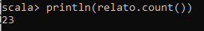


1. Execute “collect()” method on the RDD and observe the result. Remember what we said 
during the course about when it’s recommendable to use this method.

    > Hay que tener precaución con el métedo collect() porque devuelve todos los datos en local en el driver de Spark y podría causar problemas de memoria con RDDs muy grandes

    `val collectedRDD = relato.collect()`

    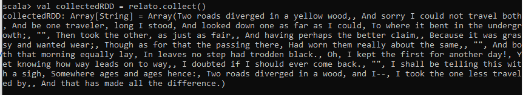

1.   Observe the rest of methods that we can apply on the RDD like we saw in the last 
exercise

        Algunos métodos interesantes aplicables a RDDs son:

        `filter`: permite filtrar los elementos de un RDD mediante una función de filtro especificada

        `map`: permite transformar cada elemento de un RDD mediante una función de transformación especificada

        `flatMap`: permite transformar cada elemento de un RDD en una secuencia de elementos, y luego concatenar todas las secuencias en un único RDD

        `reduce`: permite reducir todos los elementos de un RDD a un único valor mediante una función de reducción especificada

        `sortBy`: permite ordenar los elementos de un RDD mediante una función de clave especificada

        `distinct`: permite eliminar duplicados en un RDD

        `union`: permite combinar dos RDDs en un único RDD

        `intersection`: permite obtener la intersección de dos RDDs (es decir, los elementos que están presentes en ambos RDDs)
    

1.   If you have time, research about how to use “foreach” function to visualize the content 
of the RDD in a more appropriate way to understand it

        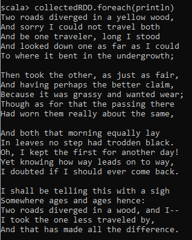

        En python nos encontramos que `.collect()` ha creado una lista en vez de otro RDD, lo cual hace que no podamos escribir la misma sentencia en python. 

        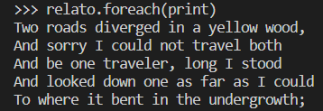

### B. Exploration of plain file 2

Tasks to be done
1. Copy the weblogs folder contained in the Spark’s exercises folder to 
“/home/BIT/data/weblogs/” and checks its content
2. Choose one of the files, open it and study how it’s structured every one of their lines 
(the data that contains, separators (white space), etc…)

3. 116.180.70.237 is the IP, 128 is the user number y GET /KBDOC-00031.html HTTP/1.0
is the article where the action rests.
4. Create a variable that contains the path of the file, for example: file:/home/BIT/data/weblogs/2013-09-15.log

    `val logPath = "file:///C:/Users/didac.blanco/Desktop/BIT/data/weblogs/2013-09-15.log"`

    En python `log_path = "file:///C:/Users/didac.blanco/Desktop/BIT/data/weblogs/2013-09-15.log"`

1. Create an RDD with the content of the file called ‘logs’

    `val logs = sc.textFile(logPath)`

    `logs = sc.textFile(log_path)`

2. Create a new RDD, ‘jpglogs’, containing only the RDD lines that contain the character 
string “.jpg”. You can use the ‘contains()’ method.

    `val jpglogs = logs.filter(x => x.contains(".jpg"))`

    `jpglogs = logs.filter(lambda x: ".jpg" in x)`

1. Print in the screen the 5 first lines of ‘jpglogs’
   
    `jpglogs.take(5).foreach(println)`

    ```python
    for log in jpglogs.take(5):
        print(log)
    ```

2. It is possible to nest several methods in the same line. Create a variable ‘jpglogs2’ that 
returns the number of lines containing the character string “.jpg”.

    `val jpglogs2 = jpglogs.count`
    
    `jpglogs2 = jpglogs.count()`

1. We will now start using one of the most important functions in Spark: “map()”. To do 
this, take the ‘logs’ RDD and calculate the length of the first 5 lines. You can use the 
functions: “size()” or “length()”. Remember that the “map()” function execute one 
function on each line of the RDD, not on the total set of the RDD.

    `logs.take(5).map(line => line.length()).foreach(println)`

    > La diferencia de python en este caso es que logs.take(5) devuelve una lista, en la cual no se puede aplicar el método map() de pySpark, la única opción es aplicar la función map() de la siguiente manera, aplicando posteriormente la función list para que nos devuelva el resultado. Tener en cuenta que esta forma es para utilizar map(), hay otras maneras de conseguir el resultado sin usar map().

    `list(map(lambda x: print(len(x)), logs.take(5)))`


1.  Print in the screen every word that contains each of the first 5 lines of the ‘logs’ RDD. 
You can use the function: “split()”.

    `logs.take(5).foreach(line => line.split(" ").foreach(println))`

    `[line.split(" ") for line in logs.take(5)]`

1.  Map the contents of the logs to an RDD called “logwords” whose contents are arrays of 
words for each line.

    `val logwords = logs.map(line => line.split(" "))`

    `logwords = logs.map(lambda x: x.split(" "))`

1.  Create a new RDD called “ips” from RDD “logs” that only contains the IPs of each line

    `val ips = logs.map(line => line.split(" ")(0))`

    `ips = logs.map(lambda line: line.split(" ")[0])`


2.  Print in the screen the first 5 lines of “ips”

    `ips.take(5).foreach(println)`

    `[print(line) for line in ips.take(5)]`

3.  Take a look to the content of “ips” with “collect()” function. You will find it’s not intuitive 
enough. Try using the “foreach” command.

    `ips.collect()`

    ```py
    for ip in ips.collect():
        print(ip)
    ```


1.  Create a “for” loop to display the contents of the first 10 lines of “ips”. Help: A ‘for’ loop 
has the following structure:
scala> for (x <- rdd.take()) { print(x) }

    `for (ip <- ips.take(10)) {println(ip)}`

    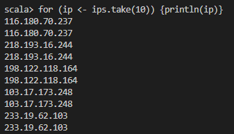

    ```py
    for ip in ips.take(10):
        print(ip)
    ```

1.  Save the whole content of “ips” in a text file using the method “saveAsTextFile” (in the 
path: “/home/cloudera/iplist”) and take a look at its contents:

    `ips.saveAsTextFile("C:\\Users\\didac.blanco\\Desktop\\BIT\\iplist")`
    `ips.saveAsTextFile("C:\\Users\\didac.blanco\\Desktop\\BIT\\iplist_python")`

### C. Exploration of a set of plain files a folder

Tasks to do:
1. Create an RDD that only contains the IPs of every document of the path: 
“C:\\Users\\didac.blanco\\Desktop\\BIT\\data\\weblogs”. Save its contents in the path: “C:\\Users\\didac.blanco\\Desktop\\BIT\\iplistw” 
and observe its content

    ```
    val logs = sc.textFile("C:\\Users\\didac.blanco\\Desktop\\BIT\\data\\weblogs")
    val ips = logs.map(_.split(" ")(0))
    ips.saveAsTextFile("C:\\Users\\didac.blanco\\Desktop\\BIT\\iplistw")
    ```

    ```py
    logs = sc.textFile("C:\\Users\\didac.blanco\\Desktop\\BIT\\data\\weblogs")
    ips = logs.map(lambda x: x.split(" ")[0])
    ips.saveAsTextFile("C:\\Users\\didac.blanco\\Desktop\\BIT\\iplistw_python")
    ```

    o, en una única línea (en scala):

    `sc.textFile("C:\\Users\\didac.blanco\\Desktop\\BIT\\data\\weblogs").map(_.split(" ")(0)).saveAsTextFile("C:\\Users\\didac.blanco\\Desktop\\BIT\\iplistw2")`

2. From the “logs” RDD, create an RDD called “htmllogs” containing only: IP and user ID of 
each “html” file. The user ID is the third field of each log line. Then print the first 5 lines. 
An example would be:

    `val htmllogs = logs.map(x => x.split(" ")(0)+"/"+x.split(" ")(2))`

    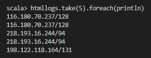

    `htmllogs = logs.map(lambda x: x.split(" ")[0]+"/"+x.split(" ")[2])`


## Module 4. Exercise: Working with PairRDDs

The objective of this exercise is to get familiar with the work with pair RDD.
### A- Work with every data of the logs folder: “C:\\Users\\didac.blanco\\Desktop\\BIT\\data\\weblogs” 
Tasks to do:
1. Using MapReduce count the number of requests of each user, in other words, count the 
number of times that each user appears on a line of a log. For that:

    a. Use a Map to create a RDD that contains the pair (ID,1), where the key is the ID 
field and the Value is the number 1. Remember that ID field is the third element 
of each line. The data obtained should look like this:

    ```
    (userida, 1)
    (userida, 1)
    (useridb, 1)
    ```

    b. Use a Reduce to sum the values of each “userid”. The data obtained should look 
like this:

    ```
    (userida, 4)
    (useridb, 8)
    (useridc, 12)
    ```

    ```scala
    val idRDD = logs.map(line => (line.split(" ")(2), 1))
    val sumRDD = idRDD.reduceByKey((x,y)=>x+y)
    ```

    ```py
    idRDD = logs.map(lambda line: (line.split(" ")[2], 1))
    sumRDD = idRDD.reduceByKey(lambda x, y: x+y)
    ```


2. Show the users id and the number of accesses for the 10 users with the highest access 
number. For that:
a. Use a “map()” to swap the Key for the Value, so you will get something like this 
(If you do not know how to do that, search on the internet):

    (4, userida)

    (8, useridb)

    (12, useridc)

    ```scala
    val sumRDD2 = sumRDD.map { case (char, num) => (num, char) }
    ```

    ```py
    sumRDD2 = sumRDD.map(lambda x: (x[1], x[0]))
    ```


    b. Use the function we saw in theory to order a RDD. Please note that we want to 
    show the data in descending order (From highest to lowest number of requests). 
    Remember that the RDD obtained must have the same structure as the original 
    RDD, in other words, with Key: “userid” and Value: “number of requests”. The 
    result should be:

    ```scala
    val rddSorted = sumRDD2.sortBy(-_._1)
    val resRddSorted = rddSorted.map { case (num, char) => (char, num) }
    ```

    ```py
    rddSorted = sumRDD2.sortBy(lambda x: -x[0])
    resRddSorted = rddSorted.map(lambda x: (x[1], x[0]))
    ```

1. Create a RDD with Key: “userid” and Value: a list of IP to which the previous “userid” has 
been connected (In other words, group the IPs for “userID”). Use “groupByKey()” function 
to do that, so the final result should be something like this: 

    (userid,[20.1.34.55, 74.125.239.98])

    (userid,[75.175.32.10,245.33.1.1,66.79.233.99])

    (userid,[65.50.196.141])


    If you have enough time try to show the RDD obtained on the screen, so that its structure 
    looks like this:
    
    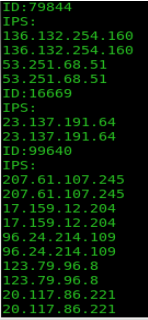
 
    ```scala
    val ipIdRDD = logs.map(line => (line.split(" ")(2), line.split(" ")(0)))
    val groupedRDD = ipIdRDD.groupByKey()
    groupedRDD.foreach { case (id, ips) =>
    println(s"ID: $id")
    println("IPS:")
    ips.foreach(println)
    }
    ```

    ```py
    ip_id_rdd = logs.map(lambda x: (x.split(" ")[2], x.split(" ")[0]))
    grouped_rdd = ip_id_rdd.groupByKey()
    for id, ips in grouped_rdd.collect():
        print(f"ID: {id}")
        print("IPS:")
        for ip in ips:
            print(ip)
    ```
### B- Work with every data of the “logs” folder: “/home/BIT/data/accounts.cvs” 
Tasks to do:
1. Open “accounts.csv” with a text editor and study its content. You will see that the first 
field is the user id, which corresponds to the user id of the web server log files. The rest 
of the fields are: date, name, surname, direction…

2. Do a JOIN between the logs data of the previous exercise and the data of “accounts.csv”, 
so that you will get a set of data with “userid” as Key and all the information of the user 
(including “userid” field) followed by the number of visits of each user as Value. The 
steps to execute are:

    a. Do a “map()” of the data of “accounts.csv” so that the Key will be “userid” and 
the Value will be the complete line (including “userid” field).

    >Como se trata de un archivo csv, se puede abrir directamente creando un data frame con `df = spark.read.csv('ruta/al/archivo.csv', header=True, inferSchema=True)` (en python) pero en este caso vamos a abrirlo como los archivos anteriores para crear un RDD

    ```scala
    val csvRDD = sc.textFile("C:\\Users\\didac.blanco\\Desktop\\BIT\\data\\accounts.csv")
    val accounts = csvRDD.map(x => (x.split(',')(0), x.split(',')))
    ```

    ```py
    csvRDD = sc.textFile('C:\\Users\\didac.blanco\\Desktop\\BIT\\data\\accounts.csv')
    accounts = csvRDD.map(lambda x: (x.split(',')[0], x.split(',')))
    ```

    b. Do a JOIN between the RDD recently created and the RDD that you created in 
the previous step, whose content is (userid, number of visits), so that you will get 
something like this:

    ```scala
    val rddjoin = accounts.join(sumRDD)
    ```

    ```py
    rddjoin = accounts.join(sumRDD)
    ```

    c. Create a RDD from the previous RDD whose content will be userid, number of 
visits, name and surname of the first 5 lines, to get a structure like the next one 
(the image shows more lines than needed):

    ```scala
    val rddfilter = rddjoin.map{ case (key, (list, count))=>
        (key, List(list(0),count,list(3),list(4)))
    }
    ```

    ```py
    rddfilter = rddjoin.map(lambda x: (x[0], [x[1][0][0], x[1][1], x[1][0][3], x[1][0][4]]))
    ```

### C- Work with more methods on pairs RDD 
Tasks to do:
1. Use “KeyBy” to create a RDD with accounts data but with the postal(ZIP) code as Key 
(ninth field of the accounts.csv file). You can research this method in the Spark’s Online 
API.
    ```scala
    val zip = csvRDD.map(x=>x.split(',')).KeyBy(x => x(8))
    ```
1. Create a pair RDD with the postal (ZIP) code as the Key and a list of names (surname, 
name) of that postal code as the Value. Those fields are 5ª and 4ª respectively in 
“accounts.csv”. 
a. If you have time, study “mapValues()” function and try to use it to fulfill the 
purpose of this exercise

    ```scala
    val zipnames = zip.mapValues(values=>values(4)+', '+values(3))
    ```

1. Sort the data by postal code and then, for the first 5 postal codes, display the postal 
code and a list of names whose accounts are in this postal (ZIP) code. The output should be similar to:
    ```
    --- 85003
    Jenkins,Thad
    Rick,Edward
    Lindsay,Ivy
    ...
    --- 85004
    Morris,Eric
    Reiser,Hazel
    Gregg,Alicia
    Preston,Elizabeth
    ```
    ```scala
    zipnames.sortByKey().take(10).foreach{
        case (x,y)=>
        println("---"+x)
        y.foreach(println)
    }
    ```

## Module 5.1. Exercise: SparkSQL (JSON)
The purpose of this exercise is to get familiar with the use of the SQL module of Spark.
Tasks to do:
1. Create a new SQLContext

    `val sqlContext = spark.sqlContext`

    ```py
    from pyspark.sql import SQLContext
    sqlContext = SQLContext(sc)
    ```

2. Import the implicits that allow us to convert a RDD in a DataFrame

    `import spark.implicits._`

3. Charge the dataset “zips.json”, which is found in the Spark’s exercises folder, in 
“/home/BIT/data/zips.json”. This dataset contains United States postal (ZIP) codes. You 
can use the command “ssc.load(“file path”, “format”)”. The dataset “zips.json” looks like 
this: 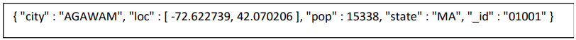

    `val df = spark.read.format("json").load("C:/Users/didac.blanco/Desktop/BIT/data/zips.json")`
    o también:
    ```scala
    val rdd = sc.textFile("C:/Users/didac.blanco/Desktop/BIT/zips.json")
    val df = rdd.toDF()
    ```

1. View the data with “show()” command. You have to see a 5-column table with a subset 
of the file data. You can see that the postal code is “_id”, the city es “city”, the location 
“loc”, the population “pop and the state “state”.

    `df.show()`

1. Get the postal (ZIP) codes whose population is greater than 10.000 using the API of 
DataFrames.

    `val dfZIP = df.filter($"pop" > 10000).select("_id")`

1. Store this table in a temporal file to execute SQL against it.

    ```
    df.write.format("parquet").save("/tmp/zipcodes")
    val dfSQL = sqlContext.read.format("parquet").load("/tmp/zipcodes")
    df.createTempView("SQL")
    ```

2. Make the same query as in point 5, but this time using SQL

    ```
    val results = sqlContext.sql("SELECT * FROM SQL WHERE pop > 10000")
    ```

3. Using SQL, get the city with more than 100 postal (ZIP) codes.
   
   ```
   sqlContext.sql("SELECT city, count(*) AS count FROM SQL GROUP BY city HAVING count(*) > 100").show()
   ```
   //Houston, 101

4. Using SQL, get the population of the Wisconsin (WI) state.

    ```
    sqlContext.sql("SELECT state, sum(pop) FROM SQL WHERE state = 'WI' GROUP BY state").show()
    ```

    // ([WI,4891769])

5.  Using SQL, get the 5 most populated states

    ```
    sqlContext.sql("SELECT state, sum(pop) FROM SQL GROUP BY state ORDER BY sum(pop) DESC LIMIT 5").show()
    ```

    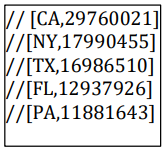

## Module 5.3. Exercise: SparkSQL (DataFrames) 
 
The purpose of this exercise is to get a bit more familiar with the DataFrames API.
1. We create a SQL context
    
    `val sqlContext = spark.sqlContext`

2. Import the implicits that allow us to convert RDDs to DataFrames and Rows
    ```
    import sqlContext.implicits._
    import org.apache.spark.sql.Row
    import org.apache.spark.sql.types.{StructType,StructField,StringType}
    ```
3. We create a variable with the file path “C:\Users\didac.blanco\Desktop\BIT\dataDataSetPartidos.txt”. The lines 
have the following format:
    ```
    idPartido::temporada::jornada::EquipoLocal::EquipoVisitant
    e::golesLocal::golesVisitante::fecha::timestamp
    ```

    ```
    val filePath: String = "C:\\Users\\didac.blanco\\Desktop\\BIT\\data\\DataSetPartidos.txt"
    ```
1. We store the content of the file in a variable.

    `var data=sc.textFile(filePath)`

2. We create a variable that contains the schema of the data

    ```
    val schemaString = "idPartido::temporada::jornada::EquipoLocal::EquipoVisitante::golesLocal::golesVisitante::fecha::timestamp"
    ```

3. We generate a schema based in the variable that contains the data schema that we 
have recently created

    ```
    val schema = StructType(schemaString.split("::").map(fieldName => StructField(fieldName, StringType, true)))
    ```

1. We convert the files of our RDD to Rows

    ```
    val rows = data.map(_.split("::")).map(p=>Row(p(0),p(1),p(2),p(3).toString,p(4).toString,p(5).toString,p(6).toString,p(7),p(8).trim))
    ```

2. We apply the Schema to the RDD

    ```
    val dfPartidos = sqlContext.createDataFrame(rows, schema)
    ```

3. We register the DataFrame as a table

    ```
    dfPartidos.createOrReplaceTempView("partidos")
    ```

    > We are now ready to make queries about the DataFrame in the following format. The results of the queries are DataFrames and support operations such as normal 
    RDDs. The columns of the results Row are accessible from an index or a field name

1.  Exercise: What is Oviedo’s goal record in a season as visitor?

    ```
    val recordOviedoVisitor = sqlContext.sql("SELECT sum(golesVisitante) AS goles, temporada FROM partidos WHERE equipoVisitante='Real Oviedo' GROUP BY temporada ORDER BY goles DESC")
    recordOviedoVisitor.take(1).println
    ```

1.  Who has been more seasons in 1 division: Sporting or Oviedo?

    ```
    val temporadasOviedo = sqlContext.sql("SELECT count(distinct(temporada)) FROM partidos WHERE equipoLocal='Real Oviedo' or equipoVisitante='Real Oviedo'")
    val temporadasSporting = sqlContext.sql("SELECT count(distinct(temporada)) FROM partidos WHERE equipoLocal='Sporting de Gijon' or equipoVisitante='Sporting de Gijon'")
    temporadasOviedo.show()
    temporadasSporting.show()
    ```

## Modulo 5.4. Ejercicios opcionales: Trabajando con SparkSQL

The aim of this exercise is to consolidate the knowledge acquired with SparkSQL in a real 
environment. For this we have a dataset with all the episodes of the Simpsons, their seasons 
and their IMDB qualification (among other parameters).
Ex1: Tasks to do
1. Take the dataset' simpsons_episodes. csv' provided by the teacher. Copy it to the virtual 
machine by dragging and dropping the file.
1. Using the terminal, transfer this dataset to the HDFS (The default path of the HDFS is: 
hdfs: //quickstart. cloudera: 8020/user/cloudera, copy the dataset to this path.)
1. The dataset we have is structured, that is, its columns have headers (as in a database). 
Take a moment to familiarize yourself with the dataset and its respective fields. 
1. The objective of this exercise is to obtain a graphical plot in which we can appreciate, 
graphically, the average score of the Simpsons' chapters during all their seasons. This 
exercise is a possible real case in which we can obtain information and extract 
conclusions by analyzing a multitude of data.
1. To load ‘csv’ files into Spark we need to use this library, while to create the graphical 
plot from the data we obtain we need this one. To execute Spark from the terminal and 
indicate the libraries we want to use, we must execute the command (IMPORTANT TO 
EXECUTE WITHOUT SPACES):

    `spark-shell --packages com.databricks:spark-csv_2.10:1.5.0,org.sameersingh.scalaplot:scalaplot:0.0.4`
    - Note that when executing the above command, Spark will automatically load the 
libraries, as it will download them from the Maven Central repository, where both 
are hosted.
1. While loading the Spark console, you'll notice that it takes more time and that you see 
more information on the screen. This is due to the fact that Spark is downloading and 
adding the libraries indicated in the previous step. Once Spark has loaded, copy these 
IMPORTS to the console:
    ```
    import org.sameersingh.scalaplot.Implicits._
    import org.sameersingh.scalaplot.MemXYSeries
    import org.sameersingh.scalaplot.XYData
    import org.sameersingh.scalaplot.XYChart
    import org.sameersingh.scalaplot.gnuplot.GnuplotPlotter;
    ```
1. Investigate on internet how to transform a CSV file into a Dataframe in Spark 1.6 and 
perform the transformation.
   - HINT: As you can see in point 5, to carry out the transformation we have imported 
the library “com.databricks.spark.csv”.

    `val df = spark.read.format("csv").option("header", "true").load("C:/Users/didac.blanco/Desktop/BIT/data/simpsons.csv")`

1. As the data is structured, we will use SparkSQL. The development from here can be 
done in different ways, but, logically, the explanation of the exercise will focus on one 
of them. In the theory part we have seen that Spark can execute SQL commands over a 
dataset creating a virtual table using the method:
    ```
    df.createOrReplaceTempView("VirtualTableName")
    ```
    ```
    df.createOrReplaceTempView("simpsons")
    ```
1. Once we have the virtual table created, we will have to create a DataFrame with the 
data: season and the average of the scores for that season. Look up your notes for the 
command to execute SQL code in Spark and make the result a DataFrame. Once you 
have the above command, it executes the SQL code necessary to obtain the data you 
are looking for. Hints:
   - The “season” field is in STRING format, you will need to change it to INT.
   - The resulting DataFrame must be sorted ASCENDENT by season number.
   - You will find the predefined SQL functions CAST and MEAN very useful.

    ```
    val dfSeasonRating = spark.sql("SELECT CAST(season AS INT), ROUND(MEAN(imdb_rating), 2) as avg_rating FROM simpsons GROUP BY season ORDER BY season ASC")
    ```

1.  Once you execute what is required in the previous point, it displays the resulting 
Dataframe on screen to ensure that the result is as expected.
    - `df.show()` 
    - Being df the Dataframe resulting from the execution of the previous step.
1.  As we are making a real case, we have been able to see that the data is not always in 
the format that interests us most (we have had to change the type of STRING to INT). It 
changes the format of the previous Dataframe to a PairRDD (RDD made up of a key 
and a value, the key being the season number and the value being the mean score for 
that season). You will find useful the functions seen in the theory.

1.  We are now entering the final stage of the exercise and we want to create, with our 
results, a linear plot that represents the information obtained, so that it is easier for us 
to extract conclusions. Now we need to divide the previous RDD, so that we will store 
in a variable Y the different seasons that we have analyzed, while we will store in a 
variable X the average scores of those seasons. Note that the variable ‘rdd’ is the name 
of the variable containing the PairRDD obtained in the previous step.
    - val x =
    - val y =
1.  Now open a new terminal. Make sure you are on the path:"/home/cloudera" and 
create a new folder called "docs". Use the command "mkdir" to do this.
1.  In that same terminal, run the command: `sudo yum install gnuplot`. This command will 
install a utility needed to perform the linear diagram.
1.  Back at the Scala terminal, run the following code to create the linear diagram. Enter 
each line one at a time to avoid problems. Once executed and, if everything has gone 
well, searches for the result in the folder created in step 13.
    ```
    val series = new MemXYSeries(x.collect(), y.collect(), "score")
    val data = new XYData(series)
    val chart = new XYChart("Average Simpsons episode scores during their seasons", data)
    output(PNG("docs/", "test"), chart)
    ```
    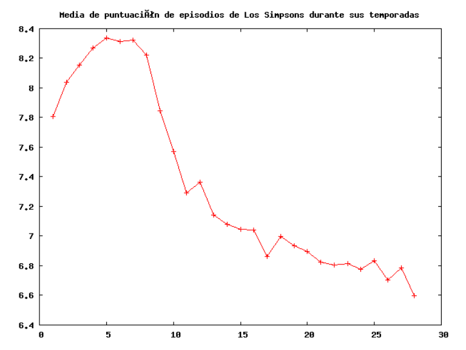


## Module 6.1. Exercise: Spark Streaming I
The aim of this exercise is to get started in the use of Spark Streaming and observe its qualities. 
To do this, we will generate an execute a script in a terminal that will count the words that we 
introduce in another terminal as simulated streaming.
Tasks to do
1. Visit Spark’s documentation https://spark.apache.org/docs/1.5.2/streaming-programming-guide.html and get familiar with the exercise. The aim is to do the same 
that it says on the web in “A Quick Example” section.
2. Take a time to navigate through the website and to explore it. When you think you are 
ready, start the exercise.
3. Open a new terminal and type the next command: “nc -lkv 4444”. What that command 
does is to send everything that you write to the 4444 port.
4. Open a new terminal and start Spark’s shell in local mode with at least 2 threads, 
because we will need them to complete this exercise: “spark-shell --master local[2]”
5. Now, access to the file “/usr/lib/spark/conf/log4j.properties”, and change the log level 
to ERROR, so that you can easily see the streaming of counted words returned by your 
script.
6. Import the necessary classes to work with Spark Streaming
    ```
    import org.apache.spark.streaming.StreamingContext
    import org.apache.spark.streaming.StreamingContext._
    import org.apache.spark.streaming.Seconds
    ```
1. Create a SparkContext with a 5 seconds duration.
    ```
    var ssc = new StreamingContext(sc,Seconds(5))
    ```
2. Create a DStream to read text from the port that you type in the command “nc”, you 
also have to type the hostname of your machine, which is “quickstart.cloudera”.
    ```
    var mystream = ssc.socketTextStream("localhost",4444)
    ```
1. Create a MapReduce, as we saw in theory, to count the number of words that appear in 
each Stream.
    ```
    var words = mystream.flatMap(line => line.split("\\W"))
    var wordCounts = words.map(x => (x, 1)).reduceByKey((x,y) => x+y)
    ```
1.  Print on the screen the results of each batch
   
    `wordCounts.print()`
2.  Start the Streaming Context and call to “awaitTermination” to wait until the task finish
    ```
    ssc.start()
    ssc.awaitTermination()
    ```
1.  You should see something like this:

    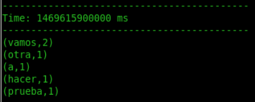
2.  Once you have finished, exit the terminal where the command “nc” is executed typing 
CNTRL +C.
1.  To run it from a script: 
spark-shell --master local[2] -i prueba.scala

