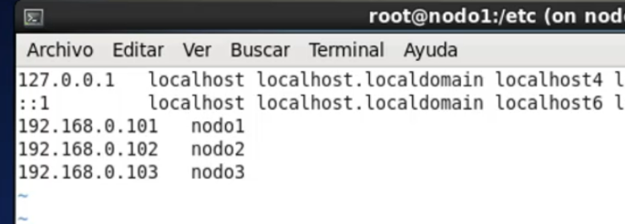
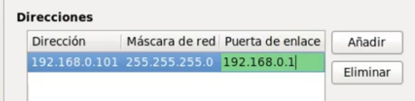

# Pasos para montar un cluster Hadoop

## Descargas e instalación iniciales

1. El primer paso es descargar VirtualBox para ejecutar la máquina virtual. Personalmente he elegido descargar Kubuntu, que también hay que descargar desde la página oficial
2. Una vez descargado, configuramos la máquina virtual configurando manualmente, con los parámetros recomendados, le ponemos de nombre "nodo1" y creamos el usuario hadoop.
3. Para entrar en usuario root, primero le asignamos una contraseña con el comando `sudo passwd root` y luego para entrar en este modo escribimos `su - root`.
4. Instalar el jdk de java, para comprobar que está todo bien se puede escribir `javac` o `java -version`.

## Empieza la configuración Hadoop

1. Antes que nada, se edita el archivo `.bashrc` de la carpeta personal de usuario (/home/hadoop), y añadimos lo siguiente
    ```sh 
    export JAVA_HOME=/usr/java/jdkXXXXX
    export PATH=$PATH:$JAVA_HOME/bin
    ```
2. Descarga e instalación de hadoop
   - Acceder como usuario root
   - Descargar la última versión disponible. En el curso se trabaja con la versión 2, pero descargo la versión 3.
   - Realizamos la instalación en el directorio `/opt`, para ello desempaquetamos el fichero en ese directorio `tar xvf hadoopXXX-bin.tar` y cambiamos el nombre de la carpeta para que quede más limpio `mv hadoop-XXXX hadoop`. 
   - Comprobamos que está todo bien con `ls -l /opt/hadoop`
   - Lo más importante: le damos permisos al usuario sobre esta carpeta
        ```sh
        chown -R hadoop:hadoop hadoop
        ```
3. Volvemos al usuario hadoop y seguimos editando el fichero `.bashrc`, añadimos:
    ```sh
    export HADOOP_HOME=/opt/hadoop
    export PATH=$PATH:/$HADOOP_HOME/bin
    export HADOOP_CONF_DIR=$HADOOP_HOME/etc/hadoop
    ```
    - Para reiniciar la sesión podemos escribir `. ./.bashrc`
    - para comprobar que accedemos correctamente: `hadoop -h` y `hadoop version`
    - Más adelante para solucionar un error, he tenido que editar el archivo `hadoop-env.sh` en la carpeta de configuración, seguramente del estilo `hadoop/etc/hadoop/hadoop-env.sh` [solución en stackoverflow](https://stackoverflow.com/questions/8827102/hadoop-error-java-home-is-not-set)
4. Podemos probar ahora el primer mapreduce, para ello realizamos los siguientes pasos

        ```sh
        cd /opt/hadoop
        mkdir /tmp/input
        cp etc/hadoop/*.xml /tmp/input/
        hadoop jar share/hadoop/mapreduce/hadoop-mapreduce-examples-2.9.jar grep /tmp/input /tmp/output 'dfs[a-z.]+'
        ls -l /tmp/output/
        ```
## Configurar SSH
1. Entramos como usuario hadoop y creamos las claves con `ssh-keygen`.  Esto habrá creado un directorio denominado /home/hadoop/.ssh (si no existía
ya) y habrá creado dos ficheros con las clave pública y la privada.
2. Realizamos lo siguiente:
    ```sh
    cd .ssh
    cp id_rsa.pub authorized_keys
    ```
    Esto habría que hacerlo en todos los nodos, de momento solo tenemos uno
3. Comprobamos que tenemos acceso con `ssh nodo1` y podemos salir escribiendo `exit`.

## Instalación pseudodistribuida
1. Accediendo como root, creamos el directorio `mkdir /datos` y le damos permisos al usuario hadoop `chown hadoop:hadoop /datos`. Volvemos a logear como hadoop.
2. Acceder a `/opt/hadoop/etc/hadoop`, vamos a cambiar unas cuantas configuraciones.
   1. En el archivo `core-site.xml`, agregar:
        ```js
        <configuration>
            <property>
                <name>fs.defaultFS</name>
                <value>hdfs://nodo1:9000</value>
            </property>
        </configuration>
        ```
    2. Editamos el archivo `hdfs-site.xml`, como solo tenemos un nodo, ponemos 1 en factor de replicación.
        ```js
        <configuration>
            <property>
                <name>dfs.replication</name>
                <value>1</value>
            </property>
            <property>
                <name>dfs.namenode.name.dir</name>
                <value>/datos/namenode</value>
            </property>
            <property>
                <name>dfs.datanode.data.dir</name>
                <value>/datos/datanode</value>
            </property>
        </configuration>
        ```
3. Creamos ahora los directorios para el sistema de archivos, no se tienen por qué llamar así pero les ponemos este nombre para que quede más claro (se incluyen en la configuración), tampoco es necesario crear las carpetas pero nos evita problemas de permisos.
    ```sh
    mkdir /datos/namenode
    mkdir /datos/datanode
    ```
4. Formateamos el sistema de ficheros que acabamos de crear: `dfs namenode -format`. Si todo es correcto, deberíamos tener un directorio en cada carpeta denominado `current`.
   
## Arrancamos HDFS
1. Para arrancar los procesos, debe arrancar **NAMENODE**, **SECONDARY NAMENODE** y **DATANODE**.
   ```sh
   start-dfs.sh
   ```
2. Con el comando `jps` podemos comprobar los procesos en ejecución.
- http://nodo1:9870
- http://nodo1:8088

3. Para tareas como realizar un checkpoint, podemos entrar en modo seguro. Se puede comprobar en el directorio /datos/namenode por ejemplo.
    ```sh
    hdfs dfsadmin -safemode enter
    hdfs dfsadmin -saveNamespace
    hdfs dfsadmin -safemode leave
    ```

## Administración de HDFS
1. Podemos realizar un report del sistema `hdfs dfsadmin -report`
2. Comprobar con hdfs fsck el estado del sistema de ficheros o de un directorio concreto `hdfs fsck /`
3. La topología actual `hdfs dfsadmin -printTopology`
4. Y comprobar si hay algún fichero abierto `hdfs dfsadmin -listOpenFiles`

## Snapshots
1. Permitimos la creación de snapshots en el directorio que queramos `hdfs dfsadmin -allowSnapshot /datos4`
2. Creamos un snapshot llamado s1 en el directorio `hdfs dfs -createSnapshot /datos4 s1`
3. Comprobamos que se ha creado satisfactoriamente `hdfs dfs -ls /datos4/.snapshot`
4. Una vez modificado el original, para recuperar el snapshot podemos escribir `hadoop fs -cp /datos4/.snapshot/s1/f1.txt /datos4/`

## Yarn en entornos pseudodistribuídos
### Configuración
1. El curso manda copiar el archivo mapred-site.xml.template, en mi caso ya lo tengo creeado sin .template
2. Ponemos la siguiente propiedad
    ```js
    <property>
        <name>mapreduce.framework.name</name>
        <value>yarn</value>
    </property>
    ```
3. En el fichero yarn-site.xml ponemos ([link](https://hadoop.apache.org/docs/stable/hadoop-yarn/hadoop-yarn-site/yarn-service/QuickStart.html#Configure_and_start_HDFS_and_YARN_components%20y%20https://programmerclick.com/article/8992195719/)). Para obtener el classpath escribir `hadoop classpath`
    ```js
    <configuration>

    <!-- Site specific YARN configuration properties -->
    <property>
        <description>
        Enable services rest api on ResourceManager.
        </description>
        <name>yarn.webapp.api-service.enable</name>
        <value>true</value>
    </property>

    <property>
            <name>yarn.application.classpath</name>
            <value>/opt/hadoop/etc/hadoop:/opt/hadoop/share/hadoop/common/lib/*:/opt/hadoop/share/hadoop/common/*:/opt/hadoop/share/hadoop/hdfs:/opt/hadoop/share/hadoop/hdfs/lib/*:/opt/hadoop/share/hadoop/hdfs/*:/opt/hadoop/share/hadoop/mapreduce/*:/opt/hadoop/share/hadoop/yarn:/opt/hadoop/share/hadoop/yarn/lib/*:/opt/hadoop/share/hadoop/yarn/*</value>
    </property>

    </configuration>
    ```
    > CHOQUE CON CURSO, ESTO PUEDE SER CAUSA DE ERROR, OTRA OPCIÓN ES
    ```JS
    <property>
        <name>yarn.resourcemanager.hostname</name>
        <value>nodo1</value>
    </property>
    <property>
        <name>yarn.nodemanager.aux-services</name>
        <value>mapreduce_shuffle</value>
    </property>
    <property>
        <name>yarn.nodemanager.aux-services
        .mapreduce_shuffle.class</name>
        <value>org.apache.hadoop.mapred.ShuffleHandler</value>
    </property>
    ```
    > Esto ha sido importante para que funcionen todos los nodos, a esto se refiere en el siguiente punto. Para comprobar que los nodos están funcionando, se puede ejecutar `yarn node -list`
4. Seguramente haya que añadir más datos si el entorno no es pseudodistribuído, ver pdf del curso
### Ejemplo de Yarn
1. Después de arrancar hdfs, ejecutramos `start-yarn.sh`
2. Comprobamos que sale el proceso yarn si escribimos `jps`
3. Para guardar el registro de jobs lanzados podemos usar `mapred --daemon start historyserver`

4. Es posible que en hadoop3 no funcione correctamente el yarn, puede ser que haya que añadir a yarn-site.xml
    ```js
    <property>
    <name>yarn.application.classpath</name>
    <value>
    /opt/hadoop3/hadoop/etc/hadoop,
    /opt/hadoop3/share/hadoop/common/*,
    /opt/hadoop3/share/hadoop/common/lib/*,
    /opt/hadoop3/share/hadoop/hdfs/*,
    /opt/hadoop3/share/hadoop/hdfs/lib/*,
    /opt/hadoop3/share/hadoop/mapreduce/*,
    /opt/hadoop3/share/hadoop/mapreduce/lib/*,
    /opt/hadoop3/share/hadoop/yarn/*,
    /opt/hadoop3/share/hadoop/yarn/lib/*
    </value>
    </property>
    ```
5. Para esta prueba, descargamos por ejemplo el libro del quijote y lo introducimos en el sistema de ficheros de hdfs `hdfs dfs -put /home/hadoop/Descargas/quijote.txt /practica`
6. `hadoop jar /opt/hadoop/share/hadoop/mapreduce/hadoop-mapreduce-examples-2.9.0.jar wordcount /practicas/quijote.txt /practicas/resultado`
7. Comprobamos el resultado en `hdfs dfs -ls /practicas/resultado`
8. `hdfs dfs -get /practicas/resultado/part-r-00000 /tmp/palabras_quijote.txt`
9. Recordar que en la web de YARN podemos ver información muy interesante sobre el job.

## Creación de cluster real
1. Antes de clonar la máquina virtual, se añade en configuración otra tarjeta de red con red interna. 
1. Clonamos la máquina virtual fijandose en el directorio donde se va a guardar y que cree nuevas direcciones MAC, y cambiamos el hostname por dos vías en los 3 nodos,
    ```sh
    sudo hostname nodo2
    sudo nano /etc/hostname
    sudo nano /etc/hosts
    ```
    
    ```sh
    sudo reboot
    ```
3. Configuración de red:
   1. Parámetro ipv4 ponerlo en manual
   2. Escribir las ips, puerta de enlace no tan importante
   
   3. En los 3 nodos hacer un rm * en el directorio /.ssh
   4. Efectuar el siguiente bucle
        - ssh-keygen
        - cp id_rsa.pub authorized_keys
        - scp authorized_keys nodo2:/home/hadoop/.ssh
        - ssh nodo2
        - ssh-keygen
        - cat id_rsa.pub >> authorized_keys
        - scp authorized_keys nodo3:/home/hadoop/.ssh
        - ssh nodo3
        - ...
    5. Tendremos un archivo authorized_keys duplicado en todos los nodos
    6. Para terminar habría que `chmod 0600 authorized_keys`
4. Editar los archivos de configuración
   1. `cd /datos/datanode` debería estar vacío en los esclavos y `namenode` no debería existir
   2. en el maestro borrar `datanode` y no hace falta vaciar `namenode`, habría que hacer únicamente un `-format`
   3. editar hdfs-site.xml para cambiar el número de replicación (a 2) y copiarlo al resto de nodos
   4. editar archivo `workers` y escribir nodo2 y nodo3

## Hive
- Nota: Para ejecutar hive la versión 11 de java no es compatible, así que es conveniente usar java 8 desde el principio, para hacer [downgrade](https://askubuntu.com/questions/1133216/downgrading-java-11-to-java-8)
- Después del downgrade, editar los archivos .bashrc y hadoop-env.sh en todos los nodos para tener bien el path
1. Instalar hive en /opt/hadoop/hive y volver a editar .bashrc
    ```
    export PDSH_RCMD_TYPE=ssh
    export HADOOP_HOME=/opt/hadoop
    export JAVA_HOME=/usr/lib/jvm/java-8-openjdk-amd64
    export HIVE_HOME=/opt/hadoop/hive
    export ZOOKEEPER_HOME=/opt/hadoop/zoo
    export PATH=$PATH:$JAVA_HOME/bin:$HIVE_HOME/bin:$ZOOKEEPER_HOME/bin
    ```
    recordar que se puede volver a ejecutar con `. /.bashrc`
2. Archivos de configuración, seguir los siguientes pasos:
   - cd /opt/hadoop/hive/conf
   - cp hive-default.xml-template hive-site.xml
   - cp hive-env.sh.template hive-env.sh
   - cp hive-exec-log4j2.propierties.template hive-exec-log4j2.propierties
   - cp hive-log4j2.propierties.template hive-log4j2.propierties
   - cp beeline-log4j2.propierties.template beeline-log4j2.propierties
   - nano hive-env.sh
     - export HADOOP_HOME=/opt/hadoop
     - export HIVE_CONF_DIR=/opt/hadoop/hive/conf
   - hdfs dfs -mkdir /tmp (ya debería estar creado)
   - hdfs dfs -mkdir -p /user/hive/warehouse
   - hdfs dfs -chmod g+w /tmp
   - hdfs dfs -chmod g+w /user/hive/warehouse
Hive ya estaría listo para su utilización.

3. para poder utilizar hive a modo de prueba, ejecutar primero: `schematool -initSchema -dbType derby`

si no funciona, utilizar antes `mv metastore_db metastore_db.tmp` [link](https://www.edureka.co/community/63178/error-function-nucleus-ascii-already-exists)

Nos encontramos con el problema del yarn al ejecutar un job ya que no había nodos disponibles, solucionado y escrito en el punto correspondiente. Al hacer esto con el metastore ya inicializado, hizo falta reiniciar todo el sistema y por esto lo escrito antes de este párrafo. Nada grave, continuamos.

## Beeline
Para poder conectarse en remoto, hay que editar el archivo
cd /opt/hadoop/hive/conf
kate hive-site.xml
editar hive.server2.enable.doAs
y poner value=false

he tenido que reiniciar para que funcione

