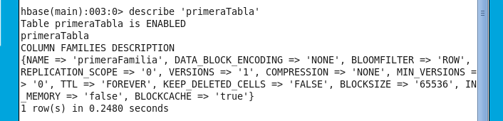
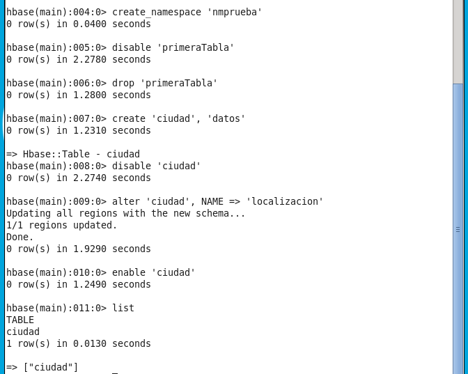
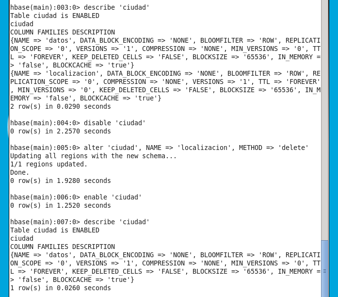
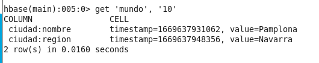
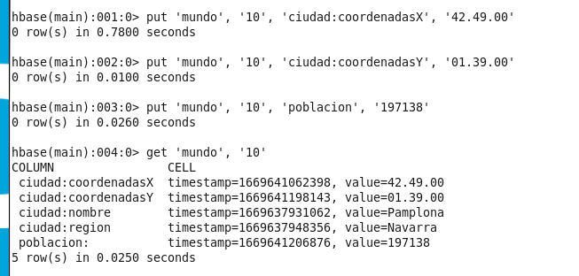
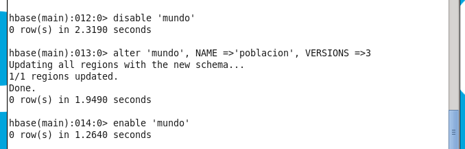
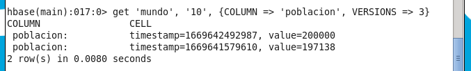
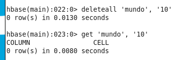

# Ejercicios

- [Ejercicios](#ejercicios)
  - [Usando la SHELL de Hbase](#usando-la-shell-de-hbase)
  - [Acceso a datos](#acceso-a-datos)
  - [Usando el API de desarrollador](#usando-el-api-de-desarrollador)

## Usando la SHELL de Hbase 
 

1. Comencemos abriendo la terminal. 

2. Abrimos Hbase → $ hbase shell 

3. Vamos a crear nuestra primera tabla. Crear una tabla llamada primeraTabla que tenga una columna de familia llamada primeraFamilia. 

    `create 'primeraTabla', 'primeraFamilia'`
    > Nos puede mostrar el siguiente error `Can't get master address from ZooKeeper. I am getting this error on Creating Hbase table`. Se soluciona reiniciando la máquina virtual. [Solución](https://community.cloudera.com/t5/Support-Questions/HBase-Can-t-get-master-address-from-ZooKeeper-I-am-getting/m-p/29935).

4. Comprueba que la tabla se ha creado correctamente. Puedes usar el comando describe. 

    

5. Creamos un namespace de nombre nmprueba: 

    `create_namespace 'nmprueba'`

6. Deshabilitamos la tabla que hemos creado anteriormente. 

    `disable 'primeraTabla'`

7. Borrar la primera tabla que hemos creado.  

    `drop 'primeraTabla'`

8. Crea una nueva tabla llamada ciudad. 

    `create 'ciudad', 'datos'`

9. Modifica la tabla ciudad y añade una nueva familia de columna que se llame localización. 

    `disable 'ciudad'`

    `alter 'ciudad', NAME => 'localizacion'`

    `enable 'ciudad'`

10. Intenta ver todas las tablas del sistema. 

    `list`

    

11. Modificar la familia de columna localización para que solo guarde una versión. 

    `disable 'ciudad'`

    `alter 'ciudad', NAME =>'localizacion', VERSIONS =>1`

    `enable 'ciudad'`

12. Borra la familia localización de la tabla ciudad. 

    `disable 'ciudad'`

    `alter 'ciudad', NAME =>'localizacion', METHOD => 'delete'`

    `enable 'ciudad'`

13. Comprueba que los cambios se han realizado. 

    `describe 'ciudad'`

    

    >Vemos que ya no se describe la familia localización

## Acceso a datos

1. Abre la shell de HBase
2. Creamos una tabla llamada mundo, con dos familias de columnas; ciudad y población. 

    `create 'mundo', 'ciudad', 'poblacion'`

3. Obtener la fila 1000 de la tabla mundo. Debería no existir. 

    `get 'mundo', '1000'` 

4. Introducimos en la tabla mundo una fila con las siguientes características: 

    - Nombre de la tabla: 'mundo' 

    - Clave: '10' 

    - Column Family: 'ciudad' 

    - Column descriptor: 'nombre' y el valor 'Pamplona' 

    - Column descriptor: 'region' y el valor 'Navarra' 

    `put 'mundo', '10', 'ciudad:nombre', 'Pamplona'`

    `put 'mundo', '10', 'ciudad:region', 'Navarra'`

5. Comprueba que la tabla se ha creado correctamente. 

    

6. Añade ahora a esa fila, otros dos descriptores; uno para las coordenadas del eje X y otro para las coordenadas del eje Y. Los valores que debes introducir son: 42°49′00″N y 1°39′00″O respectivamente. Para no tener problemas con el formato de las coordenadas introducir los números así: 42.49.00. 

    `put 'mundo', '10', 'ciudad:coordenadasX', '42.49.00'`

    `put 'mundo', '10', 'ciudad:coordenadasY', '01.39.00'`

7. Además, añade a esa fila la población de pamplona: 197 138 habitantes. 

    `put 'mundo', '10', 'poblacion', '197138'` 

8. Comprueba finalmente que los datos se han insertado correctamente. 

    

9.  Supongamos que la población de Pamplona ha cambiado en los últimos años y hay que actualizar la base de datos. Ahora Pamplona debe tener 200.000 habitantes. 

    `put 'mundo', '10', 'poblacion', '200000'` 

10. Obtener la fila con clave 10 (Pamplona), mostrando los 3 últimos valores de habitantes que han sido almacenados. 

    >Por defecto tengo que se guarde 1 versión solamente, así que primero editamos esta característica.

    

    `get 'mundo', '10', {COLUMN => 'poblacion', VERSIONS => 3}`

    

11. Borrar los campos de coordenadas. 

    `delete 'mundo', '10', 'ciudad:coordenadasX'` 

    `delete 'mundo', '10', 'ciudad:coordenadasY'` 

12. Comprueba que se han borrado dichos campos. 

    `get 'mundo', '10'`

13. A continuación, borra la fila entera correspondiente a Pamplona (key = 10) 

    `deleteall 'mundo', '10'` 

14. Comprueba que la operación se ha realizado correctamente. 

    

## Usando el API de desarrollador