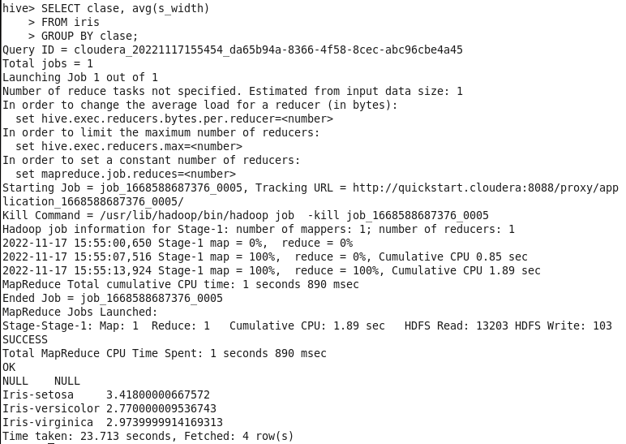

#  HIVE

- [ HIVE](#-hive)
  - [Preguntas](#preguntas)
  - [Ejercicios](#ejercicios)

## Preguntas

**1. Cita algunas razones por las que no reemplazarías una RDBM por Hive**

Una RDBM será más efectiva para conjuntos de datos más pequeños o menos complicados, sobretodo con un menor número de columnas. Si queremos más velocidad, las queries en Hive pueden ser de alta latencia debido a su procesamiento en lotes a través de Hadoop.

Otra razón por la que elegir una RDBM podría ser la necesidad de procesar datos en tiempo real, es decir, la necesidad de insertar, actualizar o eliminar filas constantemente.

**2. Cuáles son los beneficios de Hive y Hadoop sobre DWH tradicionales**

Gracias a trabajar en HDFS, permite el manejo de datos mucho más complejos y sobredimensionados, escalables tanto en número de filas como de columnas. Nos da la oportunidad de trabajar con grandes volúmenes de datos gracias a MapReduce (en los que hacer análisis rápido no es viable). MapReduce nos ofrece una estructura escalable, efectiva en términos de coste, flexible y segura.

**3. Qué datos almacena el metastore de Hive**

Almacena y hace un seguimiento de metadatos, las tablas y sus tipos (en una base de datos específica).

**4. Cuando hacemos una consulta en Hive sobre una tabla, dónde reside físicamente esa tabla**

Las tablas de Hive residen en `/user/hive/warehouse/directory` en HDFS y sus implicaciones.

**5. Qué comando se usa para cambiar el foco a otra tabla en hive**

[duda] >USE???

**6. Cuál es el comando usado para combinar el resultado de varias queries en un solo resultado**

```sql
UNION ALL
```

**7. Cuál es el directorio por defecto del warehouse de Hive**

`/user/hive/warehouse`

**8. Dónde se almacenan las tablas particionadas en Hive**

En distintos subdirectorios

**9.  Cuál es la diferencia entre el tipo de datos SequenceFile y Parquet**

SequenceFile almacena los datos en filas y Parquet en columnas, lo que permite un análisis de subconjuntos más sencillo

**10. Cuál es la diferencia entre Arrays y Maps**

La diferencia es que el map tiene asociado una key o nombre, lo cual permite llamar específicamente a un dato en concreto, mientras que array lo que permite es únicamente tenerlos ordenados. 

**11. Cuál es la query más rápida en Hive**

[duda] show table porque solo accede a metadatos

## Ejercicios

**1. Entrar a Hive**
**2. Modificar la propiedad correspondiente para mostrar por pantalla las cabeceras de las tablas**

`set hive.cli.print.header=true`

**3. Crear una base de datos llamada “cursohivedb”**

`CREATE DATABASE cursohivedb;`

**4. Situarnos en la base de datos recién creada para trabajar con ella**

`USE cursohivedb;`

**5. Comprobar que la base de datos está vacía**

`SHOW TABLES;`

**6. Crear una tabla llamada “iris” en nuestra base de datos que contenga 5 columnas (s_length float,s_width float,p_length float,p_width float,clase string) cuyos campos estén separados por comas (ROW FORMAT DELIMITED FIELDS TERMINATED BY ',')**

```bash
CREATE TABLE iris(
    > s_length float,
    > s_width float,
    > p_length float,
    > p_width float,
    > clase string
    > )
    > ROW FORMAT DELIMITED FIELDS TERMINATED BY ',';
```

**7. Comprobar que la tabla se ha creado y el tipado de sus columnas**

`DESCRIBE iris`

**8. Importar el fichero “iris_completo.txt” al local file system del cluster en la carpeta /home/cloudera/ejercicios/ejercicios_HIVE**

**9. Copiar el fichero a HDFS en la ruta /user/cloudera/hive. Reailzar las acciones necesarias**

```shell
$ hadoop fs -mkdir /user/cloudera/hive
$ hadoop fs -put /home/cloudera/ejercicios/ejercicios_HIVE/iris_completo.txt /user/cloudera/hive
```

**10. Comprueba que el fichero está en la ruta en HDFS indicada**

```shell
$ hadoop fs -ls /user/cloudera/hive
```

**11. Importa el fichero en la tabla iris que acabamos de crear desde HDFS**

```
$ hive
USE cursohivedb;
LOAD DATA INPATH '/user/cloudera/hive/iris_completo.txt'
INTO TABLE iris;
```

**12. Comprobar que la table tiene datos**

```
SELECT *
FROM iris
LIMIT 10;
```

**13. Mostrar las 5 primeras filas de la tabla iris**

```
SELECT *
FROM iris
LIMIT 5;
```

**14. Mostrar solo aquellas filas cuyo s_length sea mayor que 5. Observad que se ejecuta un MapReduce y que el tiempo de ejecución es un poco mayor**

```
SELECT *
FROM iris
WHERE s_length > 5;
```

**15. Seleccionar la media de s_width agrupados por clase. Observad que ahora el tiempo de ejecución aumenta considerablemente.**

```
SELECT clase, avg(s_width)
    > FROM iris
    > GROUP BY clase;
```


**16. Pregunta: vemos que aparece un valor NULL como resultado en la query anterior. ¿Por qué? ¿cómo los eliminarías?**

> Porque cuenta el caso de que la clase sea NULL, y como en este caso no hay ninguna entrada, la media de valores respuesta es NULL también. Lo eliminaría con alguna condición del estilo IF NOT NULL.

```
SELECT clase, avg(s_width)
    > FROM iris
    > WHERE clase != NULL
    > GROUP BY clase;
```

**17. Insertar en la tabla la siguiente fila (1.0,3.2,4.3,5.7,"Iris-virginica")**


**18. Contar el número de ocurrencias de cada clase**

```
SELECT clase, count(clase)
    > FROM iris
    > GROUP BY clase;
```

**19. Seleccionar las clases que tengan más de 45 ocurrencias**

```
SELECT clase
    > FROM iris
    > GROUP BY clase
    > HAVING count(*) > 45;
```

**20. Utilizando la función LEAD, ejecutar una query que devuelva la clase, p_length y el LEAD de p_length con Offset=1 y Default_Value =0, particionado por clase y ordenado por p_length.**

```
SELECT clase, p_length, 
LEAD(p_length,1,0) OVER (PARTITION BY clase ORDER BY p_length)
FROM iris
```

**21. Utilizando funciones de ventanas, seleccionar la clase, p_length, s_length, p_width, el número de valores distintos de p_length en todo el dataset, el valor máximo de s_length por clase y la media de p_width por clase, ordenado por clase y s_length de manera descendente.**

```
SELECT clase, p_length, s_length, p_width,
COUNT(p_length) OVER (PARTITION BY p_length), 
MAX(s_length) OVER (PARTITION BY clase),
AVG(p_width) OVER (PARTITION BY clase)
FROM iris
ORDER BY clase, s_length DESC;
```