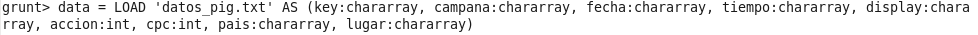
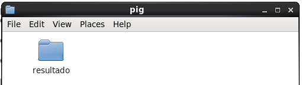
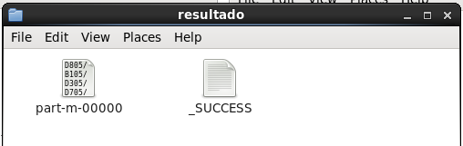

# EJERCICIOS PIG

## PARTE 1

1. Arranca el Shell de Pig en modo local.
    `pig -x local`
    > Por defecto arranca en HDFS

2. Carga los datos en pig en una variable llamada “data”. Los nombres de las columnas deben ser (key, campana, fecha, tiempo, display, accion, cpc, pais, lugar). Los tipos de las columnas deben ser chararray excepto acction y cpc que son int. 

    >Dentro del propio shell de pig, podemos situarnos en el directorio `/home/cloudera/ejercicios` para no tener que escribir la ruta completa

    

3. Usa el comando DESCRIBE para ver el esquema de la variable “data”.
    ```
    grunt> DESCRIBE data;
    data: {key: chararray,campana: chararray,fecha: chararray,tiempo: chararray,display: chararray,accion: int,cpc: int,pais: chararray,lugar: chararray}
    ```

4. Selecciona las filas de “data” que provengan de USA. 

    `data_from_usa = FILTER data BY pais == 'USA';`

5. Listar los datos que contengan en su key el sufijo surf.

    `surf_data = FILTER data BY key == 'surf.*'`

6. Crear una variable llamada “ordenado” que contenga las columnas de data en el siguiente orden: (campaña, fecha, tiempo, key, display, lugar, accion, cpc).

    `ordenado = FOREACH data GENERATE campana, fecha, tiempo, key, display, lugar, accion, cpc;`

7. Guarda el contenido de la variable “ordenado” en una carpeta en el local file system de tu MV llamada resultado en la ruta /home/cloudera/ejercicios/pig 

    `STORE ordenado INTO 'resultado';`

    > Tener cuidado de no mover el archivo original antes de usar el comando STORE

8. Comprobar el contenido de la carpeta.

    
    