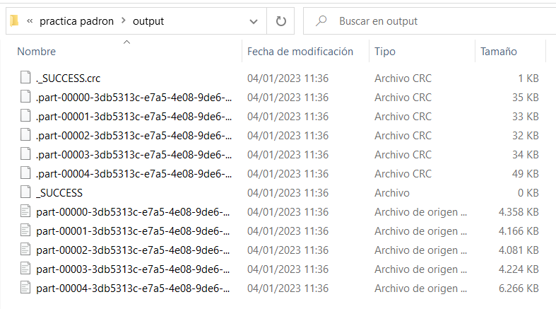

# Práctica Hive + Impala + HDFS + Spark

- [Práctica Hive + Impala + HDFS + Spark](#práctica-hive--impala--hdfs--spark)
  - [1 - Creación de tablas en formato texto.](#1---creación-de-tablas-en-formato-texto)
  - [2 - Investigamos el formato columnar parquet.](#2---investigamos-el-formato-columnar-parquet)
  - [3 - Juguemos con Impala](#3---juguemos-con-impala)
  - [4 - Sobre tablas particionadas](#4---sobre-tablas-particionadas)
  - [5. Trabajando con tablas en HDFS](#5-trabajando-con-tablas-en-hdfs)
  - [6. Un poquito de Spark](#6-un-poquito-de-spark)
  - [¿Y si juntamos Spark y Hive?](#y-si-juntamos-spark-y-hive)


A partir de los datos (CSV) de Padrón de Madrid (https://datos.madrid.es/egob/catalogo/200076-1-padron.csv) llevar a cabo lo siguiente:
## 1 - Creación de tablas en formato texto.
1. Crear Base de datos "datos_padron"

    ```
    CREATE DATABASE padron;
    ```
    
2. Crear la tabla de datos padron_txt con todos los campos del fichero CSV y cargar los datos mediante el comando LOAD DATA LOCAL INPATH. La tabla tendrá formato texto y tendrá como delimitador de campo el caracter ';' y los campos que en el documento original están encerrados en comillas dobles '"' no deben estar envueltos en estos caracteres en la tabla de Hive (es importante indicar esto utilizando el serde de OpenCSV, si no la importación de las variables que hemos indicado como numéricas fracasará ya que al estar envueltos en comillas los toma como strings) y se deberá omitir la cabecera del fichero de datos al crear la tabla.

    ```sql
    set hive.serdes.using.metastore.for.schema=org.apache.hadoop.hive.serde2.OpenCSVSerde; --permite la lectura correcta con el formato de cada columna, sin este comando se convierte todo en string

    CREATE TABLE padron_txt(
        COD_DISTRITO      INT,
        DESC_DISTRITO     STRING,
        COD_DIST_BARRIO   INT,
        DESC_BARRIO       STRING,
        COD_BARRIO        INT,
        COD_DIST_SECCION  INT,
        COD_SECCION       INT,
        COD_EDAD_INT      INT,
        ESPANOLESHOMBRES  INT,
        ESPANOLESMUJERES  INT,
        EXTRANJEROSHOMBRES INT,
        EXTRANJEROSMUJERES INT,
        FX_CARGA          STRING,
        FX_DATOS_INI      STRING,
        FX_DATOS_FIN      STRING
    )
    ROW FORMAT SERDE 'org.apache.hadoop.hive.serde2.OpenCSVSerde'
    WITH SERDEPROPERTIES (
    "separatorChar" = "\073",
    "quoteChar"     = "\"",
    "skip.header.line.count" = "1"
    )
    STORED AS TEXTFILE;

    LOAD DATA LOCAL INPATH '/home/cloudera/ejercicios/padron/estadisticas202212.csv'
    INTO TABLE padron_txt;
    ```

    ```SQL
    DESCRIBE padron_txt;
    SELECT * FROM padron_txt LIMIT 5;
    ```

3. Hacer trim sobre los datos para eliminar los espacios innecesarios guardando la tabla resultado como padron_txt_2. (Este apartado se puede hacer creando la tabla con una sentencia CTAS.)

    ```sql
    CREATE TABLE padron_txt_2 AS
    SELECT
    COD_DISTRITO AS COD_DISTRITO,
    TRIM(DESC_DISTRITO) AS DESC_DISTRITO,
    COD_DIST_BARRIO AS COD_DIST_BARRIO,
    TRIM(DESC_BARRIO) AS DESC_BARRIO,
    COD_BARRIO AS COD_BARRIO,
    COD_DIST_SECCION AS COD_DIST_SECCION,
    COD_SECCION AS COD_SECCION,
    COD_EDAD_INT AS COD_EDAD_INT,
    ESPANOLESHOMBRES AS ESPANOLESHOMBRES,
    ESPANOLESMUJERES AS ESPANOLESMUJERES,
    EXTRANJEROSHOMBRES AS EXTRANJEROSHOMBRES,
    EXTRANJEROSMUJERES AS EXTRANJEROSMUJERES,
    TRIM(FX_CARGA) AS FX_CARGA,
    TRIM(FX_DATOS_INI) AS FX_DATOS_INI,
    TRIM(FX_DATOS_FIN) AS FX_DATOS_FIN
    FROM padron_txt;
    ```
    ```SQL
    DESCRIBE padron_txt_2;
    ```
    

    ```sql
    ALTER TABLE padron_txt_2 CHANGE COD_DISTRITO COD_DISTRITO INT;
    ALTER TABLE padron_txt_2 CHANGE COD_DIST_BARRIO COD_DIST_BARRIO INT;
    ALTER TABLE padron_txt_2 CHANGE COD_BARRIO COD_BARRIO INT;
    ALTER TABLE padron_txt_2 CHANGE COD_DIST_SECCION COD_DIST_SECCION INT;
    ALTER TABLE padron_txt_2 CHANGE COD_SECCION COD_SECCION INT;
    ALTER TABLE padron_txt_2 CHANGE COD_EDAD_INT COD_EDAD_INT INT;
    ALTER TABLE padron_txt_2 CHANGE ESPANOLESHOMBRES ESPANOLESHOMBRES INT;
    ALTER TABLE padron_txt_2 CHANGE ESPANOLESMUJERES ESPANOLESMUJERES INT;
    ALTER TABLE padron_txt_2 CHANGE EXTRANJEROSHOMBRES EXTRANJEROSHOMBRES INT;
    ALTER TABLE padron_txt_2 CHANGE EXTRANJEROSMUJERES EXTRANJEROSMUJERES INT;
    ```
    ```SQL
    DESCRIBE padron_txt_2;
    ```
    
4. Investigar y entender la diferencia de incluir la palabra LOCAL en el comando LOAD DATA.

    >Si utilizamos la opción 'local' en 'load data', estamos especificando la lectura en el sistema de archivos utilizado en la máquina donde se ejecuta Hive. Si no incluyes 'local', Hive asume que los datos se encuentran en HDFS y tratará de cargarlos desde allí.

5. En este momento te habrás dado cuenta de un aspecto importante, los datos nulos de nuestras tablas vienen representados por un espacio vacío y no por un identificador de nulos comprensible para la tabla. Esto puede ser un problema para el tratamiento posterior de los datos. Podrías solucionar esto creando una nueva tabla utilizando sentencias case when que sustituyan espacios en blanco por 0. Para esto primero comprobaremos que solo hay espacios en blanco en las variables numéricas correspondientes a las últimas 4 variables de nuestra tabla (podemos hacerlo con alguna sentencia de HiveQL) y luego aplicaremos las sentencias case when para sustituir por 0 los espacios en blanco. (Pista: es útil darse cuenta de que un espacio vacío es un campo con longitud 0). Haz esto solo para la tabla padron_txt.

    > No he podido editar la tabla existente así que he creado padron_txt_3

    ```sql
    CREATE TABLE padron_txt_3 AS
    SELECT
    COD_DISTRITO,
    DESC_DISTRITO,
    COD_DIST_BARRIO,
    DESC_BARRIO,
    COD_BARRIO,
    COD_DIST_SECCION,
    COD_SECCION,
    COD_EDAD_INT,
    CASE WHEN ESPANOLESHOMBRES = '' THEN 0 ELSE ESPANOLESHOMBRES END AS ESPANOLESHOMBRES,
    CASE WHEN ESPANOLESMUJERES = '' THEN 0 ELSE ESPANOLESMUJERES END AS ESPANOLESMUJERES,
    CASE WHEN EXTRANJEROSHOMBRES = '' THEN 0 ELSE EXTRANJEROSHOMBRES END AS EXTRANJEROSHOMBRES,
    CASE WHEN EXTRANJEROSMUJERES = '' THEN 0 ELSE EXTRANJEROSMUJERES END AS EXTRANJEROSMUJERES
    FROM padron_txt;
    ```

    ```
    ALTER TABLE padron_txt_3 CHANGE COD_DISTRITO COD_DISTRITO INT;
    ALTER TABLE padron_txt_3 CHANGE COD_DIST_BARRIO COD_DIST_BARRIO INT;
    ALTER TABLE padron_txt_3 CHANGE COD_BARRIO COD_BARRIO INT;
    ALTER TABLE padron_txt_3 CHANGE COD_DIST_SECCION COD_DIST_SECCION INT;
    ALTER TABLE padron_txt_3 CHANGE COD_SECCION COD_SECCION INT;
    ALTER TABLE padron_txt_3 CHANGE COD_EDAD_INT COD_EDAD_INT INT;
    ALTER TABLE padron_txt_3 CHANGE ESPANOLESHOMBRES ESPANOLESHOMBRES INT;
    ALTER TABLE padron_txt_3 CHANGE ESPANOLESMUJERES ESPANOLESMUJERES INT;
    ALTER TABLE padron_txt_3 CHANGE EXTRANJEROSHOMBRES EXTRANJEROSHOMBRES INT;
    ALTER TABLE padron_txt_3 CHANGE EXTRANJEROSMUJERES EXTRANJEROSMUJERES INT;
    ```

6. Una manera tremendamente potente de solucionar todos los problemas previos (tanto las comillas como los campos vacíos que no son catalogados como null y los espacios innecesarios) es utilizar expresiones regulares (regex) que nos proporciona OpenCSV. Para ello utilizamos: ROW FORMAT SERDE 'org.apache.hadoop.hive.serde2.RegexSerDe' WITH SERDEPROPERTIES ('input.regex'='XXXXXXX') Donde XXXXXX representa una expresión regular que debes completar y que identifique el formato exacto con el que debemos interpretar cada una de las filas de nuestro CSV de entrada. Para ello puede ser útil el portal "regex101". Utiliza este método para crear de nuevo la tabla padron_txt_2.

    ```sql
    CREATE TABLE padron_regex(
    COD_DISTRITO      INT,
    DESC_DISTRITO     STRING,
    COD_DIST_BARRIO   INT,
    DESC_BARRIO       STRING,
    COD_BARRIO        INT,
    COD_DIST_SECCION  INT,
    COD_SECCION       INT,
    COD_EDAD_INT      INT,
    ESPANOLESHOMBRES  INT,
    ESPANOLESMUJERES  INT,
    EXTRANJEROSHOMBRES INT,
    EXTRANJEROSMUJERES INT,
    FX_CARGA          STRING,
    FX_DATOS_INI      STRING,
    FX_DATOS_FIN      STRING
    )
    ROW FORMAT SERDE 'org.apache.hadoop.hive.serde2.RegexSerDe'
    WITH SERDEPROPERTIES('input.regex'='^(\\d+)\\\;\\\"([A-Za-z]+)\\s*\\\"\\\;(\\d+)\\\;\\\"([A-Za-z]+)\\s*\\\"\\\;(\\d+)\\\;(\\d+)\\\;(\\d+)\\\;\\\"(\\d+)\\\"\\\;(\\d*)\\\;(\\d*)\\\;(\\d*)\\\;(\\d*)\\\;\\\"(\\d*-\\d*-\\d*\\s\\d*:\\d*:\\d*\\d*\\.\\d*)\\"\\;\\"(\\d*-\\d*-\\d*)\\\"\\\;\\\"(\\d*-\\d*-\\d*)\\\"$', "skip.header.line.count" = "1");

    LOAD DATA LOCAL INPATH '/home/cloudera/ejercicios/padron/estadisticas202212.csv'
    INTO TABLE padron_regex;
    ```

    

Una vez finalizados todos estos apartados deberíamos tener una tabla padron_txt que conserve los espacios innecesarios, no tenga comillas envolviendo los campos y los campos nulos sean tratados como valor 0 y otra tabla padron_txt_2 sin espacios innecesarios, sin comillas envolviendo los campos y con los campos nulos como valor 0. Idealmente esta tabla ha sido creada con las regex de OpenCSV.

## 2 - Investigamos el formato columnar parquet.

1. ¿Qué es CTAS?

    >CTAS (CREATE TABLE AS SELECT): es una consulta SQL que permite crear una nueva tabla en una base de datos a partir de los datos de otra tabla existente.
2. Crear tabla Hive padron_parquet (cuyos datos serán almacenados en el formato columnar parquet) a través de la tabla padron_txt mediante un CTAS.

    ```sql
    CREATE TABLE padron_parquet
    STORED AS PARQUET
    AS SELECT * FROM padron_txt;
    ```
3. Crear tabla Hive padron_parquet_2 a través de la tabla padron_txt_2 mediante un CTAS. En este punto deberíamos tener 4 tablas, 2 en txt (padron_txt y padron_txt_2, la primera con espacios innecesarios y la segunda sin espacios innecesarios) y otras dos tablas en formato parquet (padron_parquet y padron_parquet_2, la primera con espacios y la segunda sin ellos).

    ```sql
    CREATE TABLE padron_parquet_2
    STORED AS PARQUET
    AS SELECT * FROM padron_txt_2;
    ```
4. Opcionalmente también se pueden crear las tablas directamente desde 0 (en lugar de mediante CTAS) en formato parquet igual que lo hicimos para el formato txt incluyendo la sentencia STORED AS PARQUET. Es importante para comparaciones posteriores que la tabla padron_parquet conserve los espacios innecesarios y la tabla padron_parquet_2 no los tenga. Dejo a tu elección cómo hacerlo.
5. Investigar en qué consiste el formato columnar parquet y las ventajas de trabajar con este tipo de formatos.

    >ventajas del formato columnar:
   1. eficiencia de almacenamiento: normalmente las columnas tienen el mismo formato y valores parecidos entre ellos
   2. mayor velocidad de lectura: en las querys estilo SQL, al trabajar con columnas para filtrar, ordenar, o simplemente leer datos, el formato columnar permite no tener que leer datos innecesarios como hariamos al guardar por filas
   3. mayor escalabilidad: formato escalable y compatible con entornos distribuidos
6. Comparar el tamaño de los ficheros de los datos de las tablas padron_txt (txt), padron_txt_2 (txt pero no incluye los espacios innecesarios), padron_parquet y padron_parquet_2 (alojados en hdfs cuya ruta se puede obtener de la propiedad location de cada tabla por ejemplo haciendo "show create table").
    >los dos archivos correspondientes a la tabla parquet ocupan lo mismo: 1.2MB, mientras que la tabla sin procesar padron_txt ocupa 30MB, y la tabla procesada padron_txt_clean ocupa 12MB

## 3 - Juguemos con Impala

1. ¿Qué es Impala?
   >Impala es una herramienta para ejecutar consultas SQL en grandes conjuntos de datos en sistemas Hadoop de manera rápida y escalable.
2. ¿En qué se diferencia de Hive?
   1. Hive se enfoca en consultas a gran escala con HiveQL, mientras que Impala se enfoca en consultas en tiempo real con SQL estándar.
   2. Hive tiene una arquitectura basada en mapreduce, mientras que Impala tiene una arquitectura basada en máquinas.
   3. Impala suele ser más rápido que Hive para consultas en tiempo real, pero Hive puede ser más adecuado para consultas a gran escala con procesamiento de mapreduce.
3. Comando INVALIDATE METADATA, ¿en qué consiste?
   > El comando INVALIDATE METADATA es un comando de Impala que se utiliza para informar al sistema de que los metadatos de una tabla o vista han cambiado y deben volver a leerse. Se puede especificar un nombre de tabla o vista para invalidar solo sus metadatos o no especificar ningún nombre para invalidar los metadatos de todas las tablas y vistas en la base de datos actual. Este comando no afecta a los datos de la tabla o vista, solo a sus metadatos, y no debe utilizarse con frecuencia para evitar impactar el rendimiento del sistema.
4. Hacer invalidate metadata en Impala de la base de datos datos_padron.
    ```sql
    impala-shell
    show databases;
    use datos_padron;
    invalidate metadata;
    ```

    
5. Calcular el total de EspanolesHombres, espanolesMujeres,ExtranjerosHombres y ExtranjerosMujeres agrupado por DESC_DISTRITO y DESC_BARRIO.

    ```sql
    SELECT desc_distrito, desc_barrio, sum(cast(EspanolesHombres AS int)) AS EspanolesHombres, sum(cast(espanolesMujeres AS int)) AS espanolesMujeres, sum(cast(ExtranjerosHombres AS int)) AS ExtranjerosHombres, sum(cast(ExtranjerosMujeres AS int)) AS ExtranjerosMujeres
    FROM padron_txt_clean
    GROUP BY desc_distrito, desc_barrio;
    ```

    ```sql
    SELECT desc_distrito, desc_barrio, sum(cast(EspanolesHombres AS int)) AS EspanolesHombres, sum(cast(espanolesMujeres AS int)) AS espanolesMujeres, sum(cast(ExtranjerosHombres AS int)) AS ExtranjerosHombres, sum(cast(ExtranjerosMujeres AS int)) AS ExtranjerosMujeres
    FROM padron_parquet_clean
    GROUP BY desc_distrito, desc_barrio;
    ```
6. Llevar a cabo las consultas en Hive en las tablas padron_txt_2 y padron_parquet_2 (No deberían incluir espacios innecesarios). ¿Alguna conclusión?

    >sobre la tabla en formato normal, hive tardó 38.2s, y con el formato parquet tardó 32.5s
7. Llevar a cabo la misma consulta sobre las mismas tablas en Impala. ¿Alguna conclusión?

    >sobre la tabla en formato normal, impala tardó 0.94s, y con el formato parquet tardó 0.71s
8. ¿Se percibe alguna diferencia de rendimiento entre Hive e Impala?

    >la diferencia en tiempos de ejecución es clara

## 4 - Sobre tablas particionadas

> Para poder realizar los siguientes apartados, he tenido que editar el archivo csv con la función buscar y reemplazar, cambiando todas las 'ñ' por 'nh'.
> Para hacer una query en impala, no se puede hacer sobre una query creada con serdepropierties (sí con un CTAS sobre esta)

1. Crear tabla (Hive) padron_particionado particionada por campos DESC_DISTRITO y DESC_BARRIO cuyos datos estén en formato parquet.

    ```sql
    CREATE TABLE padron_particionado (
    COD_DISTRITO INT,
    COD_DIST_BARRIO INT,
    COD_BARRIO INT,
    COD_DIST_SECCION INT,
    COD_SECCION INT,
    COD_EDAD_INT INT,
    ESPANOLESHOMBRES INT,
    ESPANOLESMUJERES INT,
    EXTRANJEROSHOMBRES INT,
    EXTRANJEROSMUJERES INT,
    FX_CARGA STRING,
    FX_DATOS_INI STRING,
    FX_DATOS_FIN STRING
    )
    PARTITIONED BY (DESC_DISTRITO STRING, DESC_BARRIO STRING)
    STORED AS PARQUET;
    ```

2. Insertar datos (en cada partición) dinámicamente (con Hive) en la tabla recién creada a partir de un select de la tabla padron_parquet_2.

    > Para la sentencia INSERT OVERWRITE hace falta escribir esto antes en Hive
    ```sql
    SET hive.exec.dynamic.partition=true;
    SET hive.exec.dynamic.partition.mode=non-strict;
    SET hive.enforce.bucketing =true;​
    ```

    ```sql
    INSERT OVERWRITE TABLE padron_particionado PARTITION(DESC_DISTRITO, DESC_BARRIO)
    SELECT COD_DISTRITO, COD_DIST_BARRIO, COD_BARRIO, COD_DIST_SECCION, COD_SECCION, COD_EDAD_INT, ESPANOLESHOMBRES, ESPANOLESMUJERES, EXTRANJEROSHOMBRES, EXTRANJEROSMUJERES, FX_CARGA, FX_DATOS_INI, FX_DATOS_FIN, DESC_DISTRITO, DESC_BARRIO from padron_parquet;
    ```

3. Hacer invalidate metadata en Impala de la base de datos padron_particionado.

    

4. Calcular el total de EspanolesHombres, EspanolesMujeres, ExtranjerosHombres y ExtranjerosMujeres agrupado por DESC_DISTRITO y DESC_BARRIO para los distritos CENTRO, LATINA, CHAMARTIN, TETUAN, VICALVARO y BARAJAS.

    ```sql
    SELECT DESC_DISTRITO, DESC_BARRIO,
        SUM(EspanolesHombres) AS EspanolesHombres,
        SUM(EspanolesMujeres) AS EspanolesMujeres,
        SUM(ExtranjerosHombres) AS ExtranjerosHombres,
        SUM(ExtranjerosMujeres) AS ExtranjerosMujeres
    FROM padron_particionado
    WHERE DESC_DISTRITO IN ('CENTRO', 'LATINA', 'CHAMARTIN', 'TETUAN', 'VICALVARO', 'BARAJAS')
    GROUP BY DESC_DISTRITO, DESC_BARRIO
    ```

    ```sql
    SELECT DESC_DISTRITO, DESC_BARRIO,
        SUM(EspanolesHombres) AS EspanolesHombres,
        SUM(EspanolesMujeres) AS EspanolesMujeres,
        SUM(ExtranjerosHombres) AS ExtranjerosHombres,
        SUM(ExtranjerosMujeres) AS ExtranjerosMujeres
    FROM padron_parquet
    WHERE DESC_DISTRITO IN ('CENTRO', 'LATINA', 'CHAMARTIN', 'TETUAN', 'VICALVARO', 'BARAJAS')
    GROUP BY DESC_DISTRITO, DESC_BARRIO
    ```

5. Llevar a cabo la consulta en Hive en las tablas padron_parquet y padron_partitionado. ¿Alguna conclusión?

    >tiempo de ejecución en padron_parquet: 28.716 seconds, en padron_particionado: 35.583 seconds. Lo cual parece raro, repitiendo particionado baja a 29.268 seconds.

6. Llevar a cabo la consulta en Impala en las tablas padron_parquet y padron_particionado. ¿Alguna conclusión?

    >tiempo de ejecución en padron_parquet: 0.32s, en padron_particionado: 0.60s.

7. Hacer consultas de agregación (Max, Min, Avg, Count) tal cual el ejemplo anterior con las 3 tablas (padron_txt_2, padron_parquet_2 y padron_particionado) y comparar rendimientos tanto en Hive como en Impala y sacar conclusiones.

    ```sql
    SELECT DESC_DISTRITO, DESC_BARRIO,
        max(EspanolesHombres) AS EspanolesHombres
    FROM padron_particionado
    WHERE DESC_DISTRITO IN ('CENTRO', 'LATINA', 'CHAMARTIN', 'TETUAN', 'VICALVARO', 'BARAJAS')
    GROUP BY DESC_DISTRITO, DESC_BARRIO
    ```

    ```sql
    SELECT DESC_DISTRITO, DESC_BARRIO,
        max(EspanolesHombres) AS EspanolesHombres
    FROM padron_parquet
    WHERE DESC_DISTRITO IN ('CENTRO', 'LATINA', 'CHAMARTIN', 'TETUAN', 'VICALVARO', 'BARAJAS')
    GROUP BY DESC_DISTRITO, DESC_BARRIO
    ```

    |        | parquet | particion |
    |--------|---------|-----------|
    | Hive   | 25.068  | 28.002    |
    | Impala | 0.27    | 0.61      |

    > Por alguna razón, las tablas particionadas no han rendido como se esperaba. Algún problema de optimización habrá en este caso concreto pero lo normal es que funcione mejor.

## 5. Trabajando con tablas en HDFS

A continuación vamos a hacer una inspección de las tablas, tanto externas (no gestionadas) como internas (gestionadas). Este apartado se hará si se tiene acceso y conocimiento previo sobre cómo insertar datos en HDFS.

1. Crear un documento de texto en el almacenamiento local que contenga una secuencia de números distribuidos en filas y separados por columnas, llámalo datos1 y que sea por ejemplo: 
   
   1,2,3 
   4,5,6 
   7,8,9

2. Crear un segundo documento (datos2) con otros números pero la misma estructura.
   
3. Crear un directorio en HDFS con un nombre a placer, por ejemplo, /test. Si estás en una máquina Cloudera tienes que asegurarte de que el servicio HDFS está activo ya que puede no iniciarse al encender la máquina (puedes hacerlo desde el Cloudera Manager). A su vez, en las máquinas Cloudera es posible (dependiendo de si usamos Hive desde consola o desde Hue) que no tengamos permisos para crear directorios en HDFS salvo en el directorio /user/cloudera.

    `hdfs dfs -mkdir /user/cloudera/testpadron`
4. Mueve tu fichero datos1 al directorio que has creado en HDFS con un comando desde consola.

    `hdfs dfs -put /home/cloudera/Desktop/datos1 /user/cloudera/testpadron/`
5. Desde Hive, crea una nueva database por ejemplo con el nombre numeros. Crea una tabla que no sea externa y sin argumento location con tres columnas numéricas, campos separados por coma y delimitada por filas. La llamaremos por ejemplo numeros_tbl.

    ```sql
    CREATE DATABASE numeros;
    USE numeros;
    ```

    ```sql
    CREATE TABLE numeros_tbl (col1 INT, col2 INT, col3 INT) ROW FORMAT DELIMITED FIELDS TERMINATED BY ',';
    ```
6. Carga los datos de nuestro fichero de texto datos1 almacenado en HDFS en la tabla de Hive. Consulta la localización donde estaban anteriormente los datos almacenados. ¿Siguen estando ahí? ¿Dónde están?. Borra la tabla, ¿qué ocurre con los datos almacenados en HDFS?
   1. El archivo ya no está en /user/cloudera/testpadron/
   2. escribiendo en hive `DESCRIBE FORMATTED numeros_tbl;` obtenemos la información que queremos. Los datos se encuentran en `hdfs://quickstart.cloudera:8020/user/hive/warehouse/numeros.db/numeros_tbl`
        
   3. después de borrar la tabla, los datos no se encuentran en hdfs ya
7. Vuelve a mover el fichero de texto datos1 desde el almacenamiento local al directorio anterior en HDFS.
   
8. Desde Hive, crea una tabla externa sin el argumento location. Y carga datos1 (desde HDFS) en ella. ¿A dónde han ido los datos en HDFS? Borra la tabla ¿Qué ocurre con los datos en hdfs?

    ```sql
    CREATE EXTERNAL TABLE numeros_tbl_externa (col1 INT, col2 INT, col3 INT) ROW FORMAT DELIMITED FIELDS TERMINATED BY ',';
    ```
    1. esta vez los datos se mantienen en la carpeta `/user/cloudera/testpadron/datos1`
    2. al borrar la tabla, los datos siguen también en la warehouse, es decir al finalizar el proceso los datos se mantienen en ambos directorios
9.  Borra el fichero datos1 del directorio en el que estén. Vuelve a insertarlos en el directorio que creamos inicialmente (/test). Vuelve a crear la tabla numeros desde hive pero ahora de manera externa y con un argumento location que haga referencia al directorio donde los hayas situado en HDFS (/test). No cargues los datos de ninguna manera explícita. Haz una consulta sobre la tabla que acabamos de crear que muestre todos los registros. ¿Tiene algún contenido?

    

    ```sql
    CREATE EXTERNAL TABLE numeros_tbl_externa (col1 INT, col2 INT, col3 INT)
    ROW FORMAT DELIMITED FIELDS TERMINATED BY ','
    LOCATION '/user/cloudera/testpadron/';
    ```
    

    >Como vemos, no hace falta definir de manera explícita los datos
10. Inserta el fichero de datos creado al principio, "datos2" en el mismo directorio de HDFSS que "datos1". Vuelve a hacer la consulta anterior sobre la misma tabla. ¿Qué salida muestra?

    >La salida de ahora es la unión de las dos tablas, es decir algo así

    |    |    |    |
    |----|----|----|
    | 1  | 2  | 3  |
    | 4  | 5  | 6  |
    | 7  | 8  | 9  |
    | 10 | 11 | 12 |
    | 20 | 21 | 22 |
    | 30 | 31 | 32 |
11. Extrae conclusiones de todos estos anteriores apartados.

    En general, podemos concluir que trabajar con tablas en HDFS nos permite tener un almacenamiento distribuido y seguro para nuestros datos. Al crear tablas internas en Hive, los datos son almacenados directamente en HDFS y están gestionados por Hive. Si borramos la tabla de Hive, los datos también son eliminados de HDFS. En cambio, al crear tablas externas en Hive, los datos son almacenados en HDFS pero no son gestionados por Hive, lo que también nos permite editar las tablas desde fuera de Hive. Si borramos la tabla de Hive, los datos no son eliminados de HDFS y siguen estando disponibles para ser utilizados por otras tablas externas o aplicaciones. Además, al crear tablas externas podemos especificar una ubicación en HDFS donde estén almacenados los datos, lo que nos permite tener un control más preciso sobre su ubicación y uso.

## 6. Un poquito de Spark

La siguiente sección de la práctica se abordará si ya se tienen suficientes conocimientos de 
Spark, en concreto de el manejo de DataFrames, y el manejo de tablas de Hive a través de 
Spark.sql.


1. Comenzamos realizando la misma práctica que hicimos en Hive en Spark, importando el csv. Sería recomendable intentarlo con opciones que quiten las "" de los campos, que ignoren los espacios innecesarios en los campos, que sustituyan los valores vacíos por 0 y que infiera el esquema.

    ```scala
    val path = "/home/cloudera/ejercicios/padron/estadisticas202212.csv"
    val df = sqlContext.read.format("com.databricks.spark.csv").option("quote", "").option("ignoreLeadingWhiteSpace", "true").option("ignoreTrailingWhiteSpace", "true").option("nullValue", "0").option("sep", ";").load(path)
    ```
    >No fucniona correctamente, hacemos el apartado 2.

2. De manera alternativa también se puede importar el csv con menos tratamiento en la importación y hacer todas las modificaciones para alcanzar el mismo estado de limpieza de los datos con funciones de Spark.

    lo hacemos en windows (spark 3.2.)
    ```
    val path = "C:/Users/didac.blanco/Documents/recursos/BIG DATA/curso/practica padron/estadisticas202212.csv"
    val df = spark.read.option("inferSchema", "true")
        .option("header", "true")
        .option("sep", ";")
        .csv(path)

    val dfTrim = df.select(df.columns.map(c=>trim(col(c)).alias(c)): _*)

    val padron = dfTrim.select(dfTrim.columns.map(c => when(col(c).isNull, 0).otherwise(col(c)).alias(c)): _*)
    ```
3. Enumera todos los barrios diferentes.
    ```
    val barrios = padron.select("DESC_BARRIO").distinct().collect().toList
    ```
4. Crea una vista temporal de nombre "padron" y a través de ella cuenta el número de barrios diferentes que hay.

    ```
    padron.createOrReplaceTempView("padron")
    spark.sql("SELECT COUNT(DISTINCT DESC_BARRIO) FROM padron").show()
    ```
5. Crea una nueva columna que muestre la longitud de los campos de la columna DESC_DISTRITO y que se llame "longitud".

    ```
    val padronLongitud = padron.withColumn("longitud", length(col("DESC_DISTRITO")))
    ```
6. Crea una nueva columna que muestre el valor 5 para cada uno de los registros de la tabla. 

    ```
    val padronNuevaColumna = padronLongitud.withColumn("nueva_columna", lit(5))
    ```
7. Borra esta columna.

    ```
    val padronDrop = padronNuevaColumna.drop("nw")
    ```
8. Particiona el DataFrame por las variables DESC_DISTRITO y DESC_BARRIO.

    ```
    val padronParticionado = padron.repartition(col("DESC_DISTRITO"), col("DESC_BARRIO"))
    ```
9.  Almacénalo en caché. Consulta en el puerto 4040 (UI de Spark) de tu usuario local el estado de los rdds almacenados.

    >No sale nada (DUDA)
10. Lanza una consulta contra el DF resultante en la que muestre el número total de "espanoleshombres", "espanolesmujeres", "extranjeroshombres" y "extranjerosmujeres" para cada barrio de cada distrito. Las columnas distrito y barrio deben ser las primeras en aparecer en el show. Los resultados deben estar ordenados en orden de más a menos según la columna "extranjerosmujeres" y desempatarán por la columna "extranjeroshombres".

    ```
    val resultado = padronParticionado
    .select("DESC_DISTRITO", "DESC_BARRIO", "ESPANOLESHOMBRES", "ESPANOLESMUJERES", "EXTRANJEROSHOMBRES", "EXTRANJEROSMUJERES")
    .groupBy("DESC_DISTRITO", "DESC_BARRIO")
    .agg(
        sum("ESPANOLESHOMBRES").alias("espanoleshombres"),
        sum("ESPANOLESMUJERES").alias("espanolesmujeres"),
        sum("EXTRANJEROSHOMBRES").alias("extranjeroshombres"),
        sum("EXTRANJEROSMUJERES").alias("extranjerosmujeres")
    )
    .sort(desc("extranjerosmujeres"), desc("extranjeroshombres"))

    resultado.show()
    ```
11. Elimina el registro en caché.

    `padronParticionado.unpersist()`
12. Crea un nuevo DataFrame a partir del original que muestre únicamente una columna con DESC_BARRIO, otra con DESC_DISTRITO y otra con el número total de "espanoleshombres" residentes en cada distrito de cada barrio. Únelo (con un join) con el DataFrame original a través de las columnas en común.

    ```
    val nuevoDF = padron
    .select("DESC_DISTRITO", "DESC_BARRIO", "ESPANOLESHOMBRES")
    .groupBy("DESC_DISTRITO", "DESC_BARRIO")
    .agg(sum("ESPANOLESHOMBRES").alias("espanoleshombres"))

    val resultado = padron.join(nuevoDF, Seq("DESC_DISTRITO", "DESC_BARRIO"))
    ```
13. Repite la función anterior utilizando funciones de ventana. (over(Window.partitionBy.....)).

    ```
    import org.apache.spark.sql.functions._
    import org.apache.spark.sql.expressions.Window
    val nuevoDF = padron
    .select("DESC_DISTRITO", "DESC_BARRIO", "ESPANOLESHOMBRES")
    .withColumn("espanoleshombres", sum("ESPANOLESHOMBRES")
    .over(Window.partitionBy("DESC_DISTRITO", "DESC_BARRIO")))
    ```
14. Mediante una función Pivot muestra una tabla (que va a ser una tabla de contingencia) que contenga los valores totales (la suma de valores) de espanolesmujeres para cada distrito y en cada rango de edad (COD_EDAD_INT). Los distritos incluidos deben ser únicamente CENTRO, BARAJAS y RETIRO y deben figurar como columnas. El aspecto debe ser similar a este:


    ```
    import org.apache.spark.sql.types.IntegerType
    val resultado = padron
    .filter($"DESC_DISTRITO".isin("CENTRO", "BARAJAS", "RETIRO"))
    .select(col("COD_EDAD_INT").cast(IntegerType).alias("COD_EDAD_INT"), col("DESC_DISTRITO"), col("ESPANOLESMUJERES"))
    .groupBy("COD_EDAD_INT")
    .pivot("DESC_DISTRITO")
    .agg(sum("ESPANOLESMUJERES").alias("espanolesmujeres"))
    .orderBy("COD_EDAD_INT")

    resultado.show()
    ```

    

15.  Utilizando este nuevo DF, crea 3 columnas nuevas que hagan referencia a qué porcentaje de la suma de "espanolesmujeres" en los tres distritos para cada rango de edad representa cada uno de los tres distritos. Debe estar redondeada a 2 decimales. Puedes imponerte la condición extra de no apoyarte en ninguna columna auxiliar creada para el caso.

        ```
        val resultadoConPorcentajes = resultado
        .withColumn("porcentaje_centro", round(col("CENTRO") / (col("CENTRO")+col("BARAJAS")+col("RETIRO")), 2))
        .withColumn("porcentaje_barajas", round(col("BARAJAS") / (col("CENTRO")+col("BARAJAS")+col("RETIRO")), 2))
        .withColumn("porcentaje_retiro", round(col("RETIRO") / (col("CENTRO")+col("BARAJAS")+col("RETIRO")), 2))

        resultadoConPorcentajes.show()
        ```

        
16.  Guarda el archivo csv original particionado por distrito y por barrio (en ese orden) en un directorio local. Consulta el directorio para ver la estructura de los ficheros y comprueba que es la esperada.

        ```
        val outDir = "C:/Users/didac.blanco/Documents/recursos/BIG DATA/curso/practica padron"
        val outputDF = padron.repartition(col("DESC_DISTRITO"),col("DESC_BARRIO"))
        outputDF.write.csv(outDir)
        ```
        
        
        
17.  Haz el mismo guardado pero en formato parquet. Compara el peso del archivo con el resultado anterior.
    
        el resultado es parecido al anterior, sin embargo ocupa unas 50 veces menos
## ¿Y si juntamos Spark y Hive?

Por último, prueba a hacer los ejercicios sugeridos en la parte de Hive con el csv "Datos Padrón" (incluyendo la importación con Regex) utilizando desde Spark EXCLUSIVAMENTE sentencias spark.sql, es decir, importar los archivos desde local directamente como tablasde Hive y haciendo todas las consultas sobre estas tablas sin transformarlas en ningún momento en DataFrames ni DataSets.

`spark.sql(<\<query>>).show()`