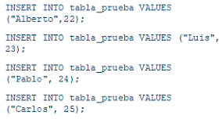
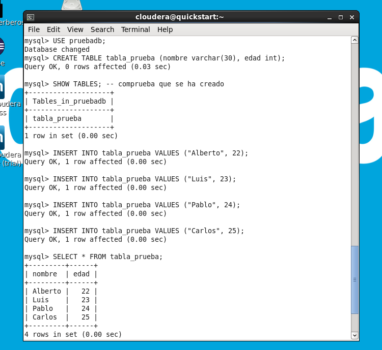
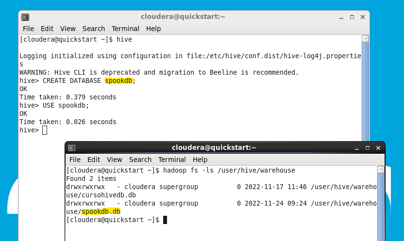
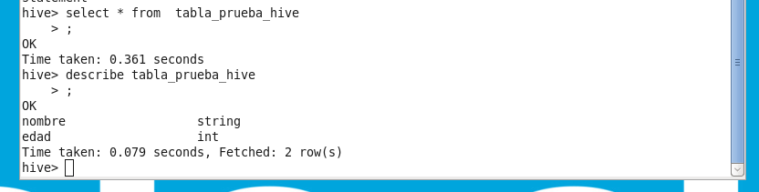
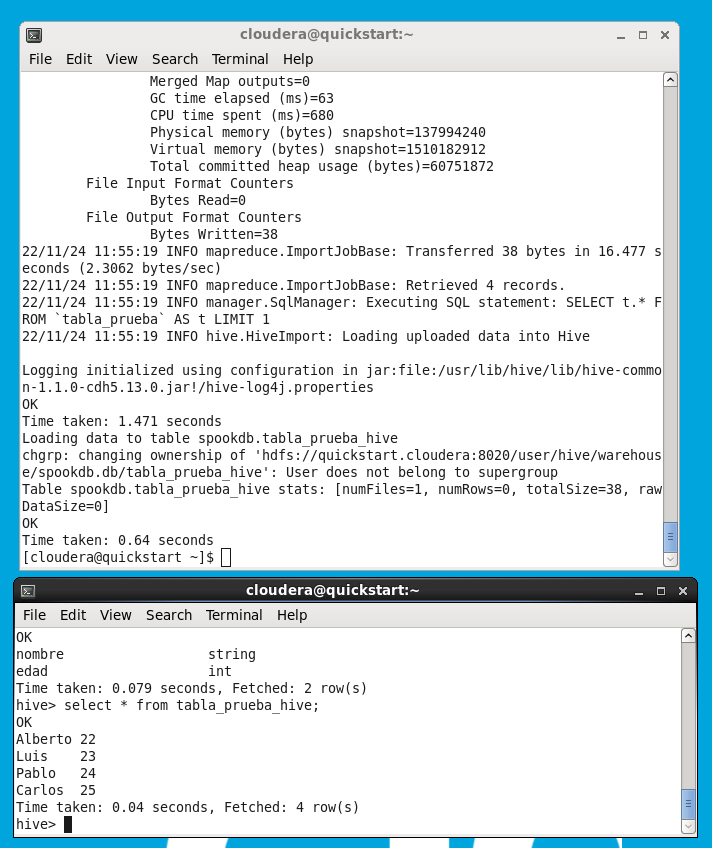

# Ejercicios Sqoop

## Creación de la tabla en mySQL
En la terminal escribimos `$ mysql -u root -p` y en password ponemos cloudera para entrar en shell de mysql.
Se nos pide:
1. ver las bases de datos
2. crear una base de datos que importaremos a hive
3. crear una tabla y añadir algunas filas
    
    

4. comprobar que todo se ha hecho bien
   
Para todo ello, escribimos lo siguiente:

```SQL
SHOW DATABASES;
CREATE DATABASE pruebadb;
USE pruebadb;
CREATE TABLE tabla_prueba (nombre varchar(30), edad int);
SHOW TABLES; -- comprueba que se ha creado
INSERT INTO tabla_prueba VALUES ("Alberto", 22);
INSERT INTO tabla_prueba VALUES ("Luis", 23);
INSERT INTO tabla_prueba VALUES ("Pablo", 24);
INSERT INTO tabla_prueba VALUES ("Carlos", 25);
SELECT * FROM tabla_prueba;
```



## Creación de la tabla en Hive

Ahora se nos pide crear la estrucrura necesaria en Hive para luego hacer la importación con Skoop. Los pasos son

1. acceder a Hive
2. crear la base de datos, acceder a ella y comprobar que está en la warehouse de hive
3. crear la estructura
4. comprobar que se ha creado con éxito 



```SQL
DROP TABLE tabla_prueba_hive;
CREATE TABLE tabla_prueba_hive
(nombre string,
edad int
)
ROW FORMAT DELIMITED
STORED AS TEXTFILE;
SHOW TABLES;
```

## Importamos la tabla con Sqoop

Primero se nos pide ejecutar unos comandos de configuración.
```shell
sudo mkdir /var/lib/accumulo 
ACCUMULO_HOME='/var/lib/accumulo' 
export ACCUMULO_HOME 
```
Para comprobar que sqoop está conectado a mysql escribimos:

`$sqoop list-databases --connect jdbc:mysql://localhost --username root --password cloudera `

Listamos la tabla de la base de datos de mySQL:

`$sqoop list-tables --connect jdbc:mysql://localhost/pruebadb --username root --password cloudera`

Ahora ya realizamos la importación. Se nos pide usar `jdbc:mysql://localhost/bbddMysql` como conector y utilizar un solo mapper.

>Antes de realizar la importación, la tabla en Hive está vacía con la estructura


`$sqoop import --connect jdbc:mysql://localhost/pruebadb --table tabla_prueba --username root --password cloudera -m 1 --hive-import --hive-overwrite --hive-table spookdb.tabla_prueba_hive`



>La última terminal muestra la tabla ya importada en el entorno Hive.
